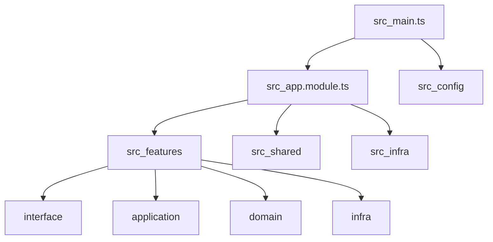

# Optimize `/src` structure (root app only)

## What we’ll optimize (based on current repo state)

- **Keep** your existing vertical-slice pattern under [`src/features/`](home/amansharma/Desktop/DevOPS/Kite-COnnect-Backend/src/features) (it already matches `application/`, `domain/`, `infra/`, `interface/`).
- **Tighten `shared/`**: remove/avoid duplication (`shared/common/*` vs top-level `shared/*`), and introduce clearer buckets (errors/types/dtos/utils/interceptors/guards) with compatibility re-exports.
- **Normalize imports**: reduce `../..` relative imports (you already have `tsconfig` paths for `@features/*`, `@shared/*`, `@infra/*`, `@config/*`).
- **Security fix**: replace hardcoded Swagger Basic Auth credentials in [`src/main.ts`](home/amansharma/Desktop/DevOPS/Kite-COnnect-Backend/src/main.ts) with env-driven config + docs.
- **Docs/flowcharts**: consolidate per-module docs inside the module folders (no “floating” docs for features), and ensure they match the code.

## Safety approach (preview-first, backward compatible)

- Work on a **new git branch** (`refactor/structure-YYYYMMDD`).
- Do a **scan + baseline build/test** before moving anything.
- Apply changes in **small, reversible batches**:
  - Move files.
  - Add **compatibility re-export stubs** at old paths (1 release cycle).
  - Rewrite imports.
- Add `// @no-refactor` escape hatch support (skip moving files containing it).

## Pre-checks (must pass before/after)

- `git status --porcelain` must be clean.
- Detect package manager (repo has `package-lock.json` and `pnpm-lock.yaml`; we’ll prefer the one your CI/docs use).
- Baseline:
  - `npm run lint` (or equivalent)
  - `npm run build`
  - `npm test`

## Scan deliverable (`refactor-scan.json`)

Create `scripts/refactor/scan-structure.mjs` to generate:

- File counts by layer (`features/*`, `shared/*`, `infra/*`, `config/*`).
- Feature modules detected (from [`src/features/`](home/amansharma/Desktop/DevOPS/Kite-COnnect-Backend/src/features)).
- “Ambiguous folders” (e.g., empty folders like current [`src/shared/filters/`](home/amansharma/Desktop/DevOPS/Kite-COnnect-Backend/src/shared/filters) and duplicates like `shared/common/*`).
- Import graph stats:
  - use `npx madge --ts-config tsconfig.json src --circular --json` (download-on-demand) and embed circulars into the report.

## Targeted refactors (minimal-change)

### 1) Fix Swagger Basic Auth (security)

- Move hardcoded constants in `src/main.ts` into env-based config:
  - `SWAGGER_BASIC_AUTH_USER`
  - `SWAGGER_BASIC_AUTH_PASS`
  - `SWAGGER_BASIC_AUTH_ENABLED` (default: enabled only in non-prod or when creds exist)
- Put config helper in [`src/config/`](home/amansharma/Desktop/DevOPS/Kite-COnnect-Backend/src/config) (e.g., `swagger-auth.config.ts`) and reference it from `main.ts`.
- Add docs:
  - update root `README.md` and add a small doc under `src/config/` describing how to enable/disable.

### 2) Normalize `shared/` layout + compatibility

- Consolidate `src/shared/common/filters/*` and `src/shared/common/interceptors/*` into the top-level `src/shared/filters/` and `src/shared/interceptors/` (or, if you prefer, rename `shared/common` into `shared/http`—we’ll pick the minimal delta).
- Create **compatibility re-export files** at the old paths for one release cycle, marked deprecated.
- Ensure all imports use `@shared/...` paths.

### 3) Add barrel exports where they reduce import noise

- Add `src/config/index.ts` to re-export configs.
- Optionally add `src/shared/index.ts` for common exports (only if it reduces churn; avoid “god index”).

### 4) Import rewrite (AST-safe)

- Write `scripts/refactor/rewrite-imports.mjs` that:
  - rewrites relative imports into `@features/*`, `@shared/*`, `@infra/*`, `@config/*` when resolvable.
  - leaves ambiguous cases unchanged and logs them to a report (`refactor-import-review.md`).

### 5) Module docs + flowcharts

- For each feature under `src/features/<feature>/`:
  - Create/merge into `README.md` with:
    - purpose
    - key routes/controllers
    - data flow
    - config/env vars used
    - a **Mermaid** flowchart if there is an existing `*.md` flow doc (many already exist under market-data/stock).
- Ensure docs remain inside their respective modules.

## Verification

- Add `scripts/refactor/refactor-verify.sh` to run: lint → build → test.
- Add `npm run refactor:verify` script alias.

## Preview diff + apply

- Produce a human-readable preview:
  - `migration-map.json` (oldPath → newPath)
  - `refactor-PR.md` summary (what moved, why, how to rollback)
  - `patchset/` (optional: `git format-patch` output)
- After your approval, apply changes batch-by-batch and keep CI green.

## Architecture snapshot (post-refactor)

