# Redis Optional Configuration - Changes Summary

## Problem Statement

The application was **crashing on startup** when Redis was not available:

```
[Nest] 155551  - 10/13/2025, 8:31:22 PM   ERROR [RedisService] Failed to connect to Redis
[Nest] 155551  - 10/13/2025, 8:31:22 PM   ERROR [RedisService] AggregateError
[Nest] 155551  - 10/13/2025, 8:31:22 PM   ERROR [Bootstrap] ❌ Failed to start application
[Nest] 155551  - 10/13/2025, 8:31:22 PM   ERROR [Bootstrap] AggregateError
```

**Root Cause:** The `RedisService.initializeRedis()` method was throwing an error when it couldn't connect to Redis, which propagated up and crashed the entire application.

## Solution

Modified `src/services/redis.service.ts` to make Redis **completely optional**:

### Key Changes

#### 1. Added Connection State Tracking

```typescript
// Added flag to track Redis availability
private isConnected: boolean = false;
```

#### 2. Modified Connection Logic (No Throw on Failure)

**Before:**
```typescript
private async initializeRedis() {
  try {
    // ... connection code ...
  } catch (error) {
    this.logger.error('Failed to connect to Redis', error);
    throw error; // ❌ This crashes the app!
  }
}
```

**After:**
```typescript
private async initializeRedis() {
  try {
    // ... connection code with timeout ...
    this.isConnected = true;
    this.logger.log('✅ Redis clients connected successfully');
  } catch (error) {
    // ✅ Log warning but don't throw - allow app to continue
    this.isConnected = false;
    this.logger.warn('⚠️  Redis connection failed - Application will continue without caching');
    this.logger.warn('⚠️  To enable Redis caching, please configure REDIS_HOST and ensure Redis is running');
    // No throw here - graceful degradation
  }
}
```

#### 3. Added Connection Timeout

```typescript
// Timeout after 5 seconds to prevent hanging
await Promise.race([
  Promise.all([
    this.client.connect(),
    this.subscriber.connect(),
    this.publisher.connect(),
  ]),
  new Promise((_, reject) => 
    setTimeout(() => reject(new Error('Redis connection timeout')), 5000)
  )
]);
```

#### 4. Added Error Event Handlers

```typescript
// Prevent uncaught errors from crashing the app
this.client.on('error', (err) => {
  console.error('[RedisService] Redis client error:', err.message);
  this.isConnected = false;
});
```

#### 5. Updated All Operations to Check Connection

**Example - `get()` method:**

**Before:**
```typescript
async get<T>(key: string): Promise<T | null> {
  try {
    const value = await this.client.get(key); // ❌ Crashes if not connected
    return value ? JSON.parse(value) : null;
  } catch (error) {
    this.logger.error(`Error getting cache key ${key}`, error);
    return null;
  }
}
```

**After:**
```typescript
async get<T>(key: string): Promise<T | null> {
  // ✅ Check if Redis is available first
  if (!this.isConnected) {
    console.log(`[RedisService] get() called but Redis not available - key: ${key}`);
    return null; // Safe default
  }
  
  try {
    const value = await this.client.get(key);
    const result = value ? JSON.parse(value) : null;
    console.log(`[RedisService] ${result ? '✅' : 'ℹ️'} Get cache key: ${key} - ${result ? 'HIT' : 'MISS'}`);
    return result;
  } catch (error) {
    this.logger.error(`Error getting cache key ${key}`, error);
    console.error(`[RedisService] ❌ Error getting key ${key}:`, error.message);
    return null; // Safe default on error
  }
}
```

#### 6. Added Comprehensive Console Logging

Every operation now logs detailed information for debugging:

```typescript
// Connection logs
console.log('[RedisService] Constructor called - initializing service');
console.log('[RedisService] onModuleInit - Attempting to initialize Redis connection');
console.log('[RedisService] Attempting to connect to Redis...');
console.log(`[RedisService] Redis config: ${redisConfig.host}:${redisConfig.port}`);

// Operation logs
console.log(`[RedisService] ✅ Set cache key: ${key} (TTL: ${ttl || 'none'})`);
console.log(`[RedisService] ✅ Get cache key: ${key} - HIT`);
console.log(`[RedisService] ℹ️  Get cache key: ${key} - MISS`);
```

#### 7. Added Helper Method

```typescript
/**
 * Check if Redis is connected and available
 */
isRedisAvailable(): boolean {
  return this.isConnected;
}
```

## Modified Methods

All 20+ Redis methods were updated with:
- ✅ Connection check at the start
- ✅ Safe default return values
- ✅ Comprehensive error handling
- ✅ Detailed console logging
- ✅ JSDoc documentation

### Complete List of Updated Methods:

| Method | Safe Default | Use Case |
|--------|-------------|----------|
| `set()` | `void` | Cache storage |
| `get()` | `null` | Cache retrieval |
| `del()` | `void` | Cache deletion |
| `exists()` | `false` | Key existence check |
| `incr()` | `0` | Counter increment |
| `decr()` | `0` | Counter decrement |
| `expire()` | `void` | TTL management |
| `hset()` | `void` | Hash storage |
| `hget()` | `null` | Hash retrieval |
| `hgetall()` | `{}` | Hash full retrieval |
| `hdel()` | `void` | Hash deletion |
| `lpush()` | `void` | List push |
| `rpop()` | `null` | List pop |
| `lrange()` | `[]` | List range |
| `publish()` | `void` | Pub/Sub publish |
| `subscribe()` | `void` | Pub/Sub subscribe |
| `unsubscribe()` | `void` | Pub/Sub unsubscribe |
| `cacheMarketData()` | `void` | Market data cache |
| `getCachedMarketData()` | `null` | Market data retrieval |
| `cacheQuote()` | `void` | Quote cache |
| `getCachedQuote()` | `null` | Quote retrieval |
| `disconnect()` | `void` | Cleanup |
| `isRedisAvailable()` | `boolean` | Status check |

## Documentation Created

### 1. `src/services/REDIS_SERVICE.md`
- Complete API documentation
- Configuration guide
- Usage examples
- Best practices
- Troubleshooting guide

### 2. `src/services/REDIS_FLOWCHART.md`
- Visual flow diagrams
- State machine diagrams
- Sequence diagrams
- Error handling flows

### 3. `LOCAL_DEVELOPMENT.md`
- Local setup guide
- Running with/without Redis
- Expected log outputs
- Quick start instructions

### 4. `REDIS_OPTIONAL_CHANGES.md` (this file)
- Summary of changes
- Before/after comparisons
- Technical details

## Testing

### Without Redis

```bash
# Stop Redis (if running)
docker stop redis

# Start the application
npm run start:dev
```

**Expected Output:**
```
[RedisService] ⚠️  REDIS NOT AVAILABLE - App running without cache
[Nest] LOG [Bootstrap] 🚀 Trading App Backend is running on port 3000
```

✅ **Application starts successfully!**

### With Redis

```bash
# Start Redis
docker run -d -p 6379:6379 redis:alpine

# Start the application
npm run start:dev
```

**Expected Output:**
```
[RedisService] ✅ Redis is ready for use
[Nest] LOG [RedisService] ✅ Redis clients connected successfully
[Nest] LOG [Bootstrap] 🚀 Trading App Backend is running on port 3000
```

✅ **Application starts with caching enabled!**

## Impact Analysis

### Positive Changes
✅ Application is fault-tolerant
✅ Works without infrastructure dependencies
✅ Better for local development
✅ Gradual deployment support
✅ Comprehensive logging for debugging
✅ Self-documenting code with JSDoc comments
✅ No breaking changes to existing code

### Trade-offs When Redis is Unavailable
⚠️  No response caching (direct DB queries)
⚠️  No pub/sub messaging
⚠️  Potentially higher database load
⚠️  Slower response times for repeated queries

### Best Use Cases

**Without Redis (Development):**
- Local development
- Testing
- Learning the codebase
- CI/CD testing environments

**With Redis (Production):**
- Production deployments
- High-traffic scenarios
- Real-time messaging needs
- Performance-critical applications

## Deployment Impact

### Before This Change

```mermaid
graph LR
    A[Deploy App] --> B{Redis Available?}
    B -->|No| C[❌ App Crashes]
    B -->|Yes| D[✅ App Runs]
```


### After This Change

```mermaid
graph LR
    A[Deploy App] --> B{Redis Available?}
    B -->|No| C[⚠️  App Runs<br/>No Cache]
    B -->|Yes| D[✅ App Runs<br/>With Cache]
```


## Conclusion

The Redis service is now **optional** and the application is **production-ready** with or without Redis. This provides:

1. **Flexibility**: Deploy without Redis initially, add it later when needed
2. **Resilience**: Application continues if Redis crashes
3. **Developer Experience**: Easy local testing without infrastructure setup
4. **Observability**: Comprehensive logging for debugging
5. **Documentation**: Complete guides for all scenarios

All changes maintain backward compatibility and require no modifications to existing code that uses RedisService.
