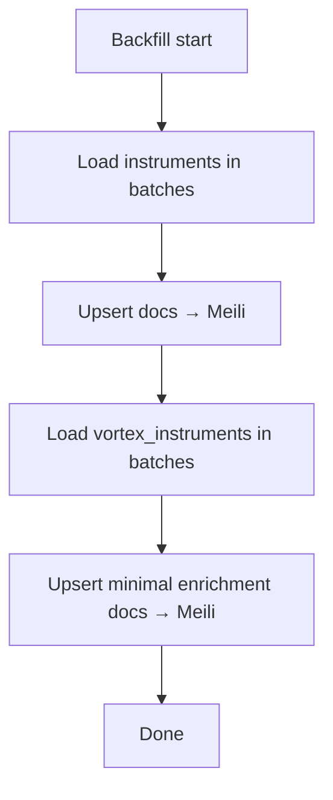
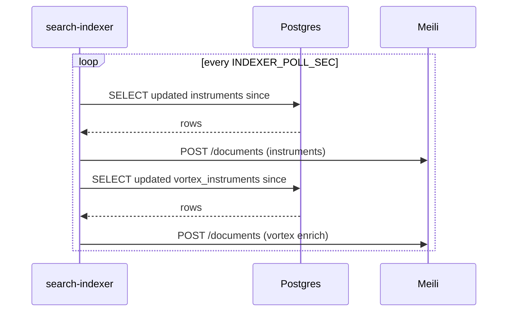

# MeiliSearch Data Coverage and Merge Rules

This document describes how the search index achieves full coverage and how fields are merged from multiple sources.

## Sources
- Postgres `instruments`: ALL rows are indexed (ignores `is_active` for coverage; `is_active` still populates `isTradable`).
- Postgres `vortex_instruments`: authoritative for `vortexExchange` and select additive fields (expiry/strike/tick/lot).
- CSV: used only when DB is unavailable, as before.

## Merge Rules (by instrumentToken)
- Keep primary textual fields from `instruments`: `symbol`, `tradingSymbol`, `companyName`.
- Enrich or override with authoritative Vortex:
  - `vortexExchange`: from `vortex_instruments.exchange`.
  - `isDerivative`, `underlyingSymbol`: inferred from Vortex instrument type and symbol.
  - `expiryDate`, `strike`, `tick`, `lotSize`: included when present.

## Backfill Flow


## Incremental Flow


## Verification
- Run backfill-and-watch and check logs:
  - "backfill base complete (postgres)"
  - "vortex enrich upserted ..." and "enrichment complete"
- Query examples:
```bash
curl -s "http://localhost:3002/api/search?q=SBIN&gt;ltp_only=true" | jq
```

## Rollout
```bash
# 1) Ensure env for indexer includes DB credentials and MEILI_* vars
# 2) Trigger a fresh backfill then watch incrementals
docker compose run --rm -e INDEXER_MODE=backfill-and-watch search-indexer

# Alternatively, restart the running indexer service
docker compose restart search-indexer

# Tail logs
docker compose logs -f search-indexer
```


