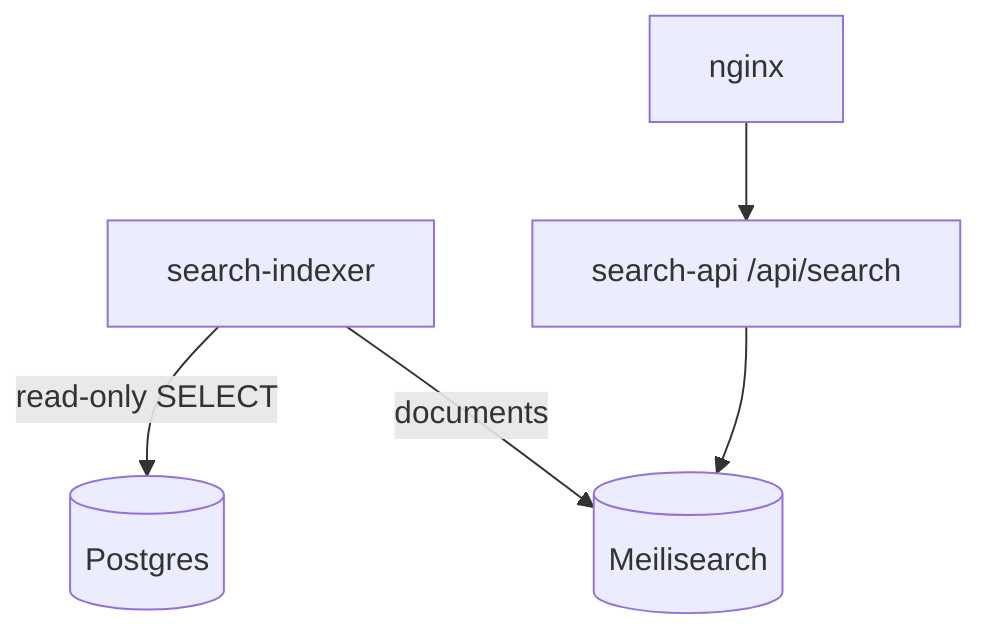

# Attach Meilisearch Indexer to Your Existing Postgres (Later)

This guide shows how to point the `search-indexer` (read-only) to your main Postgres that already receives daily instrument updates. No schema changes and no writes are performed; the indexer only SELECTs and upserts documents into Meilisearch.

## Overview
- Current state: Meilisearch is seeded via CSV fallback and working behind Nginx (`/api/search`).
- Target state: Indexer reads instruments from your main Postgres and continuously updates Meilisearch.
- Safety: Indexer is strictly read-only to Postgres.

## Prerequisites on Postgres
1. Postgres network access from your EC2 host (or from the Docker bridge network):
   - `listen_addresses = '*'` in `postgresql.conf` (or at least reachable address)
   - `pg_hba.conf` allow rules for your EC2/Docker network (e.g. `172.17.0.0/16`)
   - Firewall/SG: allow TCP 5432 from your EC2 host / Docker bridge
2. A DB user with read access to your instruments table.
3. Instruments table should expose these columns (names used by the indexer):
   - `instrument_token`, `tradingsymbol`, `name`, `exchange`, `segment`, `instrument_type`, `expiry`, `strike`, `lot_size`, `is_active`, `updated_at`

## Configure the Indexer
Edit `.env` at the repo root and set the following (examples shown):

```bash
# Reach Postgres from inside Docker; if DB runs on the EC2 host, use host.docker.internal
INDEXER_DB_HOST=host.docker.internal
INDEXER_DB_PORT=5432
INDEXER_DB_USER=your_ro_user
INDEXER_DB_PASSWORD=your_ro_password
INDEXER_DB_NAME=trading_app

# Optional: disable CSV fallback (leave unset to keep as a safety net)
# INDEXER_CSV_URL=
```

Then restart only the indexer:
```bash
docker compose up -d --force-recreate search-indexer
```

## Verify
- Logs should show a non-zero count and Postgres source:
```bash
docker compose logs -f search-indexer
# [indexer] active instruments=123456
# [indexer] backfill complete (postgres)
```
- Meilisearch documents:
```bash
docker compose exec -T search-api sh -lc \
  'curl -sS -H "Authorization: Bearer $MEILI_MASTER_KEY" \
   http://meilisearch:7700/indexes/instruments_v1/stats'
```
- API checks:
```bash
curl -sS "http://localhost:3002/api/search?q=SBIN&limit=5"
curl -ksS "https://marketdata.vedpragya.com/api/search?q=SBIN&limit=5"
```

## Troubleshooting
- ETIMEDOUT / ECONNREFUSED:
  - Confirm Postgres is listening on the desired interface (0.0.0.0 or specific IP)
  - Update `pg_hba.conf` to allow the Docker bridge subnet (default `172.17.0.0/16`)
  - Open port 5432 in ufw/security group for the EC2 host or Docker bridge
- Auth errors:
  - Verify `.env` creds and that the user has read access
- Index still empty:
  - Ensure `is_active = true` rows exist in instruments

## Rollback (to CSV fallback)
- Remove/blank the `INDEXER_DB_*` variables from `.env`
- Optionally set `INDEXER_CSV_URL=https://…/master.csv`
- Restart indexer again

## Flow (Mermaid)


## Notes
- The indexer remains read-only to Postgres at all times.
- CSV fallback stays available as a safety net unless you explicitly remove `INDEXER_CSV_URL`.
- Keep credentials only in `.env` (never commit to git).
