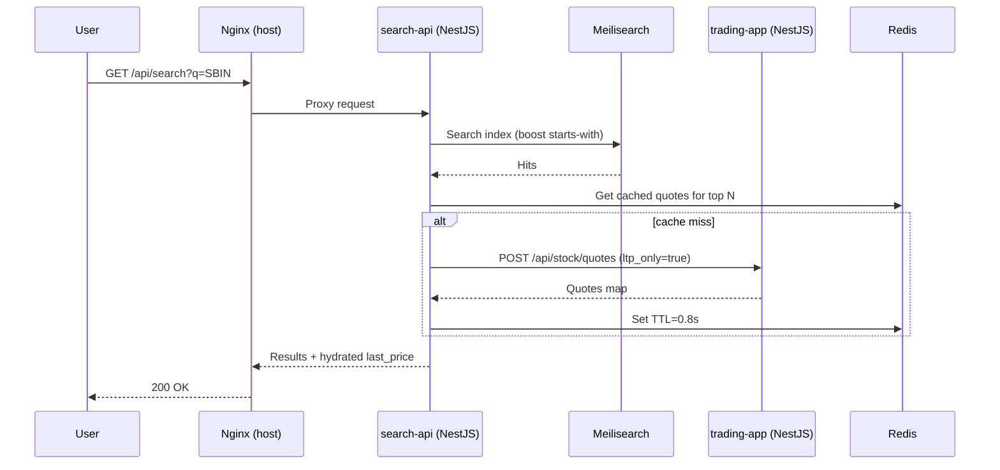
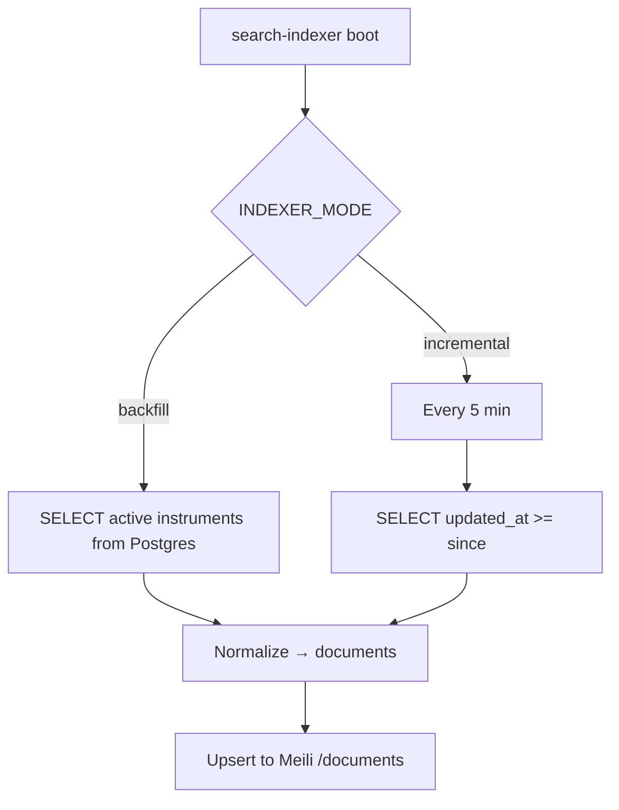

# Meilisearch Search Architecture (Local-Only, No External Backups)

## Components
- search-api (NestJS): `/api/search`, `/api/search/suggest`, `/api/search/filters`, `/api/search/popular`
- meilisearch: private search engine, internal-only (Docker network), master key protected
- search-indexer: read-only worker for backfill + incremental sync from Postgres
- trading-app: existing backend used for live quote hydration
- nginx (host): routes `/api/search*` → search-api; blocks `/meili*`

## Request Flow

## Index Build Flow

## Security
- Meili is not exposed publicly; only Docker internal network
- Nginx 403s `/meili/` and `/meilisearch/`
- Meili protected by `MEILI_MASTER_KEY`; search-api uses Bearer auth

## Sizing & Limits
- Meili: ~1–3 GB RAM for ~1–3M docs; cap with `MEILI_MAX_INDEXING_MEMORY`
- search-api: ~150–300 MB RAM; CPU low; limits set in compose
- indexer: CPU bound only during backfill; schedule off-peak if needed

## Error Handling & Observability
- Global exception filter returns structured errors with timestamps
- Request timeout interceptor with configurable `HTTP_TIMEOUT_MS`
- Hydration circuit breaker with `HYDRATE_CB_THRESHOLD`/`HYDRATE_CB_OPEN_MS`
- Console logs at key steps for rapid debugging; Nest logger for structure

## Operations (Local EC2)
- No external backups; rebuild index via `search-indexer` backfill
- Resource caps in docker-compose for Meili/search-api/indexer
- Nginx routes `/api/search` → search-api (port 3002 on host)

## Notes
- Postgres remains read-only; no schema changes, no writes
- Live quotes come from existing Vayu-powered endpoints through `trading-app`
