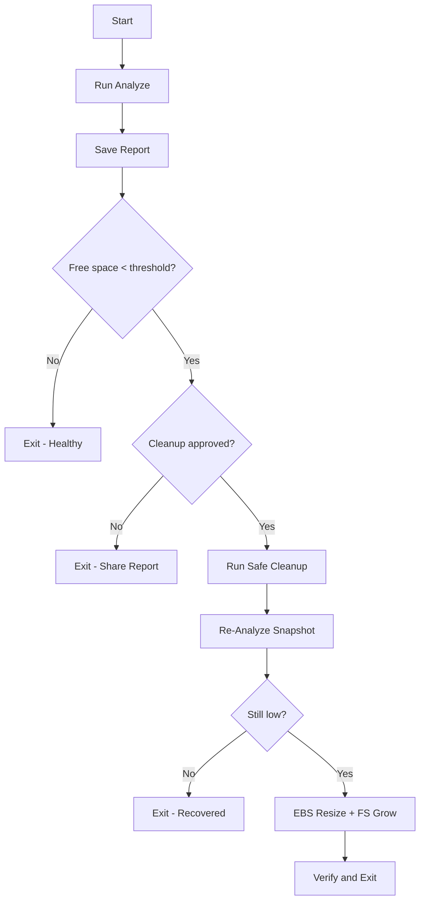

# Disk Analysis and Cleanup Runbook

This runbook documents how to analyze disk usage on the EC2 host and safely clean up space without removing running applications or attached data volumes. It accompanies the interactive script at:

`scripts/maintenance/disk-analyze-clean.sh`

## Goals
- Generate a comprehensive, timestamped report of disk/Docker usage.
- Optionally perform a conservative cleanup (journald, rotated logs, Docker unused objects/cache, apt caches).
- Avoid downtime and preserve application data (Postgres, Redis, Meilisearch, app).

## Quick Start
Analyze only and save a report (no cleanup):

```bash
sudo ./scripts/maintenance/disk-analyze-clean.sh --analyze-only
```

Analyze, then interactively confirm cleanup:

```bash
sudo ./scripts/maintenance/disk-analyze-clean.sh
```

Non-interactive approval and adjust threshold:

```bash
sudo ./scripts/maintenance/disk-analyze-clean.sh --approve --threshold-mb=4096
```

Print a minimal JSON summary to STDOUT as well:

```bash
sudo ./scripts/maintenance/disk-analyze-clean.sh --json
```

## Report Location
Reports are saved by default to:
`./logs/maintenance/disk-report-YYYY-MM-DD_HH-MM-SS.txt`

If the repository path is not writable (e.g., root is full), the script falls back to `/tmp/`.

## Flags
- `--analyze-only`: Only generate the report, no cleanup
- `--approve`: Cleanup without prompt (useful for automation)
- `--json`: Emit minimal JSON summary to STDOUT
- `--threshold-mb=N`: Warn if free space < N MB (default: 3072)
- `--log-dir=PATH`: Where reports are saved (default: ./logs/maintenance)
- `--no-docker`: Skip Docker analysis/cleanup
- `--no-apt`: Skip apt analysis/cleanup
- `--no-journal`: Skip journald analysis/cleanup
- `--no-volumes`: Do not prune Docker volumes (default behavior)
- `--prune-volumes`: Prune unused Docker volumes during cleanup
- `--log-truncate-mb=N`: Truncate container logs larger than N MB (default: 50)

## What the Script Checks
- Disk and inodes usage (`df -h`, `df -i`), filesystem types, and root device
- Top usage by directory: `/`, `/var`, `/var/lib`, `/usr`
- Docker footprint (`docker system df`, top images, volumes count, largest container logs)
- Journald disk usage
- Apt cache sizes
- Node/yarn caches (if present)
- Largest files on root filesystem
- Deleted-but-open files (if `lsof` available)

## Cleanup Actions (Safe Defaults)
- `journalctl --vacuum-size=200M`
- Delete rotated/compressed logs in `/var/log/*.gz`
- Truncate container logs larger than `--log-truncate-mb`
- `docker system prune -af` and `docker builder prune -af`
- `apt-get clean`, `apt autoremove --purge -y`, remove apt cache/list leftovers
- Remove Node/yarn caches

Notes:
- Docker volumes are not pruned by default. Enable with `--prune-volumes` if sure volumes are not needed.
- Running containers and mounted volumes are not touched.

## Flow Chart (Mermaid)



## Post-Recovery Hardening (Recommended)
- Configure Docker logging rotation:
  - System: `/etc/docker/daemon.json`
  - Compose: per-service `logging:` with `max-size: "10m"`, `max-file: "3"`
- Cap journald usage (`SystemMaxUse=500M`) in `/etc/systemd/journald.conf`, then restart `systemd-journald`.
- Auto-prune weekly via a systemd timer (images + builder cache).
- Add a free-space preflight to `scripts/update-app.sh` to abort updates if below threshold.

## Troubleshooting
- If journalctl or docker are missing, the script skips those sections and continues.
- If the report directory is not writable, the script falls back to `/tmp/` automatically.
- For tight disks that still fail to recover after cleanup, proceed with EBS volume expansion, then grow the filesystem (`growpart` + `resize2fs`/`xfs_growfs`).


