## Falcon Auth and Streaming Flow

```mermaid
sequenceDiagram
  participant Client as Client
  participant API as Backend API
  participant Kite as Kite Connect
  participant WS as WebSocket Gateway

  Client->>API: GET /api/auth/falcon/login
  API-->>Client: { url, state }
  Client->>Kite: Open login URL (api_key + state)
  Kite-->>Client: Redirect to /api/auth/falcon/callback?request_token=...
  Client->>API: GET /api/auth/falcon/callback?request_token=...&state=...
  API->>Kite: Exchange request_token → access_token
  API-->>API: Save session, cache token, set provider=kite
  API->>WS: Start or reconnect streaming (internal)
  Client->>WS: Connect wss://<host>/market-data or wss://<host>/ws
  WS-->>Client: Live ticks (provider=falcon internally)
```

Notes:
- Client WebSocket endpoints do not change across providers:
  - Socket.IO: `wss://<host>/market-data`
  - Native: `wss://<host>/ws`
- Provider selection is handled by the backend after OAuth.

