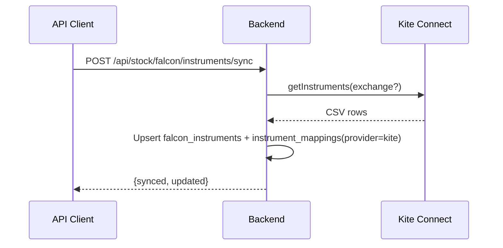

## Falcon REST Alignment (Kite)

### Headers
- Authorization: token api_key:access_token (Kite)
- Optional: X-Kite-Version: 3

### Endpoints (this service)
- POST /api/stock/falcon/instruments/sync
- POST /api/stock/falcon/instruments/sync/stream (SSE)
- GET  /api/stock/falcon/instruments/sync/status?jobId=
- GET  /api/stock/falcon/health
- GET  /api/stock/falcon/instruments
- GET  /api/stock/falcon/instruments/:token
- GET  /api/stock/falcon/instruments/search?q=&limit=
- GET  /api/stock/falcon/instruments/stats
- POST /api/stock/falcon/instruments/batch
- POST /api/stock/falcon/validate-instruments
- GET  /api/stock/falcon/ltp?tokens=token1,token2
- POST /api/stock/falcon/ltp { instruments: number[] }
- GET  /api/stock/falcon/equities?exchange=&q=&is_active=&ltp_only=&limit=&offset=
- GET  /api/stock/falcon/futures?symbol=&exchange=&expiry_from=&expiry_to=&is_active=&ltp_only=&limit=&offset=
- GET  /api/stock/falcon/options?symbol=&exchange=&expiry_from=&expiry_to=&strike_min=&strike_max=&option_type=CE|PE&ltp_only=&is_active=&limit=&offset=
- GET  /api/stock/falcon/commodities?symbol=&exchange=MCX&instrument_type=&is_active=&ltp_only=&limit=&offset=
- GET  /api/stock/falcon/tickers/search?q=&limit=&ltp_only=
- GET  /api/stock/falcon/tickers/:symbol

### Notes
- Pairs (`EXCHANGE-TOKEN`) are a Vayu concept; Falcon uses token or `i=EX:SYMBOL`.
- This backend normalizes numeric tokens and maintains a separate `falcon_instruments` table.
- Rate limits align to Kite docs: 1 rps for quotes/ltp/ohlc, 3 rps for history.

### Streaming Flow

