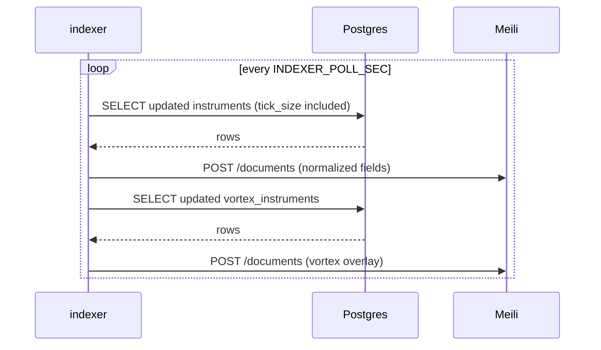

# Meilisearch ↔ Postgres Sync

This module documents end‑to‑end data flow from Postgres to Meilisearch, including vortex enrichment, verification steps, and troubleshooting.

## Flowcharts

### Backfill
```mermaid
flowchart TD
  A[search-indexer start] --> B[Ensure index + settings]
  B --> C[Load instruments from Postgres in batches]
  C --> D[toDoc: normalize + build documents]
  D --> E[POST /documents (Meili)]
  E --> F[Vortex enrichment pass]
  F --> G[POST minimal overlay /documents]
  G --> H[Complete]
```

### Incremental


## Field Mapping (DB → Meili document)

- instrument_token → instrumentToken (primary key)
- tradingsymbol → symbol, tradingSymbol, searchKeywords[0]
- name → companyName (trimmed, empty → undefined), searchKeywords[1]
- exchange → exchange (trimmed, empty → undefined)
- segment → segment (trimmed, empty → undefined)
- instrument_type → instrumentType (trimmed, empty → undefined)
- expiry → expiryDate (empty → undefined)
- strike → strike
- tick_size → tick
- lot_size → lotSize
- is_active → isTradable
- Derived: vortexExchange, ticker, isDerivative, underlyingSymbol

Vortex overlay (from `vortex_instruments`):
- token → instrumentToken (join key)
- exchange/instrument_name → vortexExchange (authoritative)
- Derivatives inference → isDerivative, underlyingSymbol
- Optional: expiryDate, strike, tick, lotSize (added when present)

## Verify Sync

Run the verification script:

```bash
bash scripts/check-meili-sync.sh
```

It checks:
- Meili health and `numberOfDocuments`
- Non‑empty facet distributions: `instrumentType`, `segment`, `vortexExchange`
- Postgres counts (total, non‑empty fields, vortex total)
- Sample of 50 instruments must exist in Meili with fields populated

Exit code is non‑zero if any check fails.

## Rollout Steps

1. Ensure `.env` contains a strong `MEILI_MASTER_KEY`.
2. Rebuild and restart the indexer for changes to take effect:
   ```bash
   docker compose build search-indexer
   docker compose up -d --force-recreate search-indexer
   ```
3. Tail logs during backfill and first incremental:
   ```bash
   docker compose logs -f search-indexer
   ```
4. Run the verification script until it passes.

## Troubleshooting

- Index missing or auth errors:
  ```bash
  docker compose logs --tail 200 meilisearch search-api
  ```
- Low `numberOfDocuments` vs DB:
  - Ensure `DB_HOST=postgres` inside `search-indexer`
  - Confirm Postgres has expected rows and `updated_at` is moving
- Empty facets in Meili:
  - Verify normalization landed (fields trimmed, empties → undefined)
  - Run a full backfill if required

## Related Docs

- See `docs/MEILISEARCH_INFRA.md` for architecture
- See `docs/MEILISEARCH_DATA_COVERAGE.md` for data coverage and merge rules


