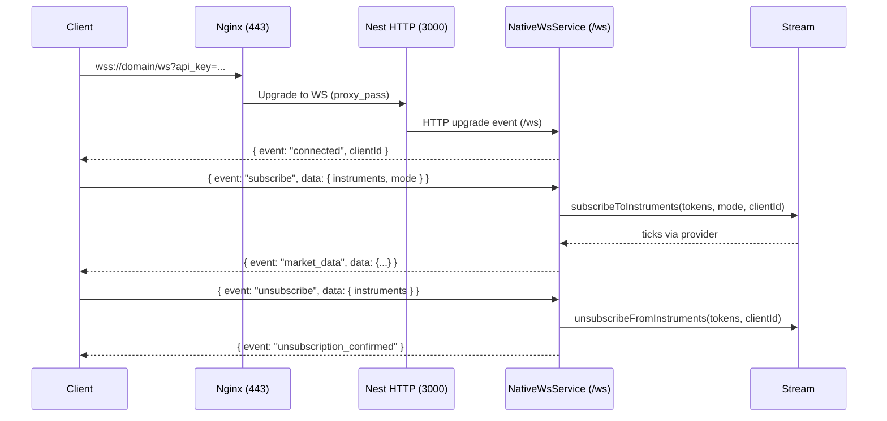

# Native WebSocket (/ws)

This service exposes a true native WebSocket endpoint for clients that do not use Socket.IO. It runs alongside Socket.IO and shares the same HTTP server.

- Endpoint: `/ws`
- URL (production): `wss://marketdata.vedpragya.com/ws?api_key=YOUR_KEY`
- Auth: `api_key` query or `x-api-key` header
- Message: JSON frames with shape `{ event: string, data?: any }`

## Events

- Client → Server
  - `subscribe`: `{ instruments: number[], mode?: 'ltp'|'ohlcv'|'full' }`
  - `unsubscribe`: `{ instruments: number[] }`
  - `get_quote`: `{ instruments: number[], ltp_only?: boolean }`
  - `get_historical_data`: `{ instrumentToken: number, fromDate: string, toDate: string, interval: string }`
  - `ping`: `{}`

- Server → Client
  - `connected`: `{ clientId, timestamp }`
  - `subscription_confirmed`: `{ instruments, mode, timestamp }`
  - `unsubscription_confirmed`: `{ instruments, timestamp }`
  - `market_data`: `{ instrumentToken, data, timestamp }`
  - `quote_data`: `{ data, cached, ltp_only?, timestamp }`
  - `historical_data`: `{ instrumentToken, data, timestamp }`
  - `error`: `{ code, message }`

## Flow



## Testing

- CLI (requires `wscat`):

```bash
scripts/test-native-ws.sh marketdata.vedpragya.com YOUR_API_KEY
```

- Browser: open `/dashboard/test-native-ws.html` and fill domain + API key.

## Implementation Notes

- Implemented in `src/services/native-ws.service.ts`; initialized in `src/main.ts` via `nativeWs.init(httpServer, '/ws')`.
- Heartbeat pings clients every 30s and terminates dead peers.
- Backpressure guard skips sends if `bufferedAmount` grows too large (~16MB).
- SSL terminates at Nginx; upgrade headers configured for `/ws` in `docker/nginx/nginx.conf`.


