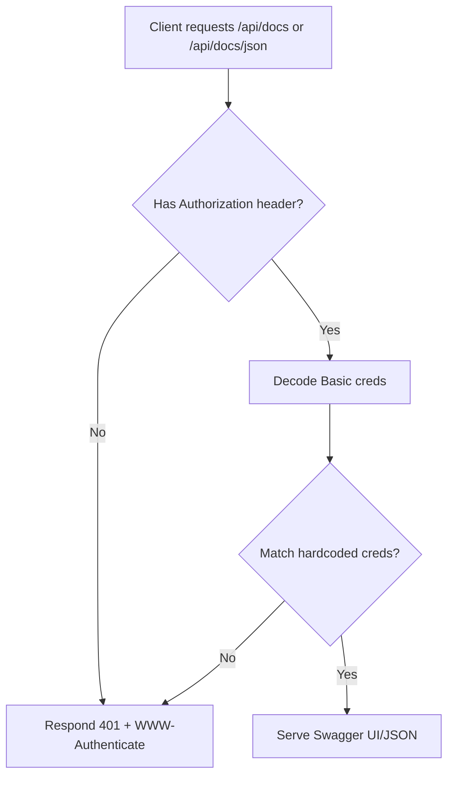

# Swagger Protection

This module documents how Swagger UI and JSON are protected in the backend.

## Access

- URL (UI): `https://marketdata.vedpragya.com/api/docs`
- URL (JSON): `https://marketdata.vedpragya.com/api/docs/json`

You will be prompted for HTTP Basic Auth credentials.

## Credentials (hardcoded)

- Username: `support@vedpragya.com`
- Password: `aman1sharma`

## cURL examples

UI request (will return HTML):

```bash
curl -u 'support@vedpragya.com:aman1sharma' \
  -H 'Accept: text/html' \
  https://marketdata.vedpragya.com/api/docs
```

JSON request:

```bash
curl -u 'support@vedpragya.com:aman1sharma' \
  -H 'Accept: application/json' \
  https://marketdata.vedpragya.com/api/docs/json
```

If behind Nginx, the `Authorization` header is forwarded to the NestJS app.

## Flow



## Implementation Notes

- Basic Auth middleware is applied to `/api/docs`, `/api/docs/json`, `/api-json`, and `/api/docs-json` to cover UI and JSON endpoints across Swagger versions.
- Swagger is configured with `jsonDocumentUrl` to also expose JSON under `/api/docs/json`. A fallback Express route binds this path explicitly.
- Logs are emitted for missing/invalid headers, failed decodes, and invalid credentials.
- To change credentials later, edit `src/main.ts` constants: `SWAGGER_USERNAME`, `SWAGGER_PASSWORD`.


