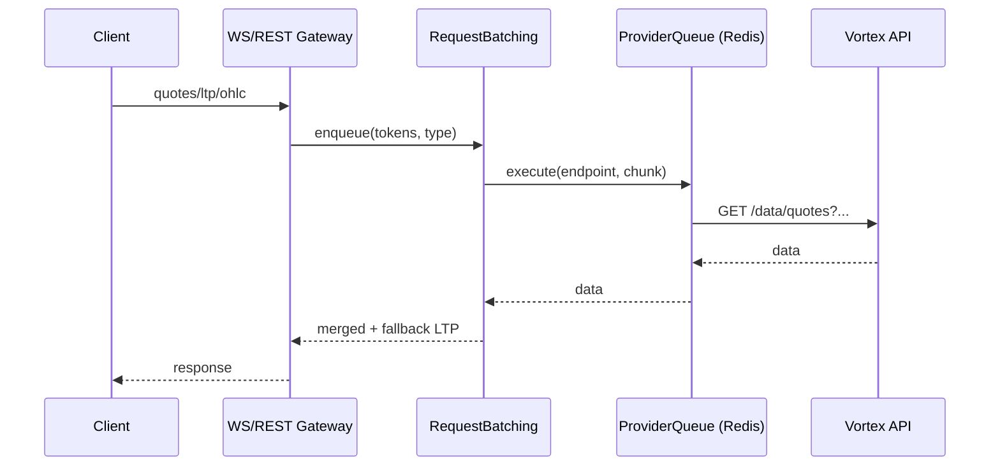
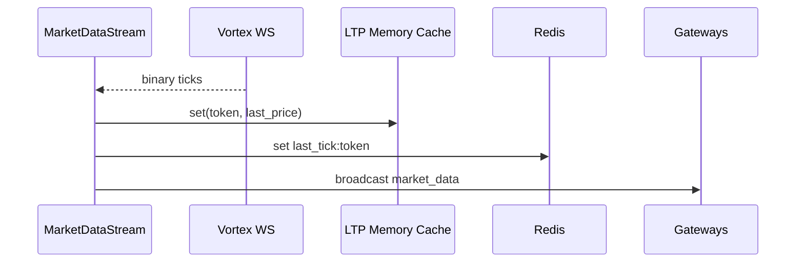

## Vayu Architecture

### Overview
- Provider-level distributed gate (1/sec per endpoint) with jitter using Redis locks
- Request batching (per-instance) → provider queue gate → Vortex HTTP
- Rolling in-memory LTP cache (5s TTL, LRU 10k)
- Instrument sync daily @08:45 with retry/backoff

### Flowcharts

