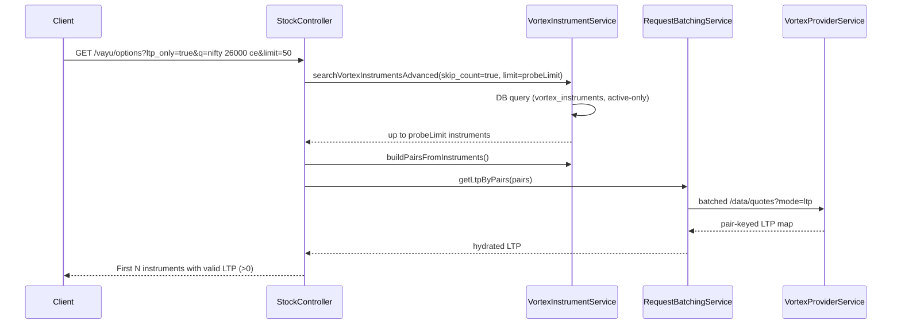

## Vayu F&O Search (NSE + MCX)

This document explains the trading-app-style search endpoints for NSE futures/options and MCX options backed by Vortex (`vayu` provider).

It complements `Vortex_api_usage.md` and `docs/vayu/rest-alignment.md` by focusing specifically on how free-text queries like `nifty 26000 ce` are parsed and executed.

---

## Endpoints

- **NSE Futures**
  - **Method**: GET  
  - **Path**: `/api/stock/vayu/futures`
- **NSE Options**
  - **Method**: GET  
  - **Path**: `/api/stock/vayu/options`
- **MCX Options (new)**
  - **Method**: GET  
  - **Path**: `/api/stock/vayu/mcx-options`

All three endpoints share a common querying model and LTP hydration behaviour.

### Common Query Parameters

| Name         | Type    | Required | Example                 | Notes                                                              |
|--------------|---------|----------|-------------------------|--------------------------------------------------------------------|
| `q`          | string  | no       | `nifty 26000 ce`       | Trading-style free text. When omitted, only structured filters apply. |
| `option_type`| string  | no       | `CE` / `PE`            | Explicit option side. When omitted, parser may infer from `q`.    |
| `expiry_from`| string  | no       | `20250125`             | Start of expiry window (YYYYMMDD). Parser may infer from `q`.     |
| `expiry_to`  | string  | no       | `20250125`             | End of expiry window (YYYYMMDD).                                  |
| `strike_min` | number  | no       | `26000`                | Minimum strike. Parser may set both `strike_min`/`strike_max`.    |
| `strike_max` | number  | no       | `26000`                | Maximum strike.                                                    |
| `limit`      | number  | no       | `50`                   | Page size (default 50, max 500).                                  |
| `offset`     | number  | no       | `0`                    | Pagination offset.                                                 |
| `ltp_only`   | boolean | no       | `true`                 | If true, only instruments with valid LTP (>0) are returned.       |

Additional endpoint-specific behaviour:

- `/vayu/futures`
  - `instrument_name` is restricted to `FUTSTK` / `FUTIDX`.
- `/vayu/options`
  - `instrument_name` is restricted to `OPTSTK` / `OPTIDX` (NSE index/stock options).
- `/vayu/mcx-options`
  - `exchange` is pinned to `MCX_FO`.
  - `options_only=true` ensures `option_type IS NOT NULL` (MCX options only; MCX futures are excluded).

---

## Trading-style Query Parsing

Parsing is implemented in `FnoQueryParserService` and is **best-effort**:

- It never throws and never overrides explicit query params.
- Output is treated as *hints* layered on top of request query parameters.

### Supported Patterns

Examples (all case-insensitive, separators flexible):

- `nifty 26000 ce`
- `banknifty 28mar25 45000 pe`
- `gold 62000 ce`

From these, the parser attempts to derive:

| Field          | Example          | Description                                      |
|----------------|------------------|--------------------------------------------------|
| `underlying`   | `NIFTY`          | First non-numeric, non-month, non-CE/PE token   |
| `strike`       | `26000`          | First numeric token > 1                         |
| `optionType`   | `CE` / `PE`      | From `CE/PE/C/P/CALL/PUT` tokens                |
| `expiryFrom`   | `20250328`       | From `YYYYMMDD`, `DDMMMYYYY`, `DDMMMYY`, `MMMYYYY` |
| `expiryTo`     | `20250328`/month-end | Same as `expiryFrom` or month window        |

### Priority Rules

1. **Explicit query parameters win**  
   - If `option_type` is provided, parser `optionType` is ignored.
   - If `strike_min`/`strike_max` are provided, parser `strike` is ignored.
   - If `expiry_from`/`expiry_to` are provided, parser expiry window is ignored.

2. **Parser hints are only used when explicit filters are absent**  
   - Parsed `strike` sets **both** `strike_min` and `strike_max` if they are undefined.
   - Parsed `expiryFrom`/`expiryTo` are used as default `expiry_from`/`expiry_to`.
   - Parsed `underlying` is mapped to `underlying_symbol` and also disables broad `query` to keep the DB predicate index-friendly.

3. **Unsafe hints are dropped**  
   - Month-only tokens like `JAN` (without a year) are not used as expiry filters.
   - Non-numeric or tiny numeric tokens are ignored as strikes.

---

## Execution Flow

### High-level Flow (NSE/MCX F&O)

```mermaid
flowchart TD
  A[Client] --> B[StockController]
  B --> C[FnoQueryParserService\nparse(q)]
  C --> D[Build filters\nunderlying_symbol, expiry_from/to,\nstrike_min/max, option_type]
  D --> E[VortexInstrumentService.searchVortexInstrumentsAdvanced]
  E --> F[DB: vortex_instruments\n(active-only, index-backed)]
  F --> G[Instrument page]
  G --> H[buildPairsFromInstruments]
  H --> I[RequestBatchingService.getLtpByPairs]
  I --> J[VortexProviderService.getLTPByPairs]
  J --> K[Vortex /data/quotes?mode=ltp]
  K --> L[Pair-keyed LTP map]
  L --> M[Merge into instruments\n(last_price, performance.queryTime)]
  M --> N[HTTP JSON response]
```

Key points:

- **Exchange resolution** is taken from `vortex_instruments.exchange`, not inferred from user input.
- **MCX options** use `exchange = 'MCX_FO'` + `options_only=true` to guarantee only options are returned.
- **NSE futures/options** still honour the existing `instrument_type` filters.

### LTP-only Fast Path

When `ltp_only=true`, the endpoints follow the documented fast-path:



---

## Response Shape

All three endpoints return a consistent F&O-centric shape:

```json
{
  "success": true,
  "data": {
    "instruments": [
      {
        "token": 135938,
        "symbol": "NIFTY",
        "exchange": "NSE_FO",
        "description": "NSE_FO NIFTY 25JAN2025 26000 CE",
        "expiry_date": "20250125",
        "instrument_name": "OPTIDX",
        "option_type": "CE",
        "strike_price": 26000,
        "tick": 0.05,
        "lot_size": 50,
        "last_price": 104.1
      }
    ],
    "pagination": {
      "total": 1234,
      "hasMore": true
    },
    "ltp_only": false,
    "performance": {
      "queryTime": 27
    }
  }
}
```

Notes:

- For `ltp_only=true`, `pagination.total` is `undefined` and `hasMore` reflects the underlying page probe.
- `last_price` comes from Vortex quotes (mode=ltp) via pair-based hydration.

---

## Error Handling & Logging

- All endpoints wrap their bodies in `try/catch` and return:
  - `500` with `{ success: false, message, error }` on unexpected errors.
- Parsing and filter derivation are logged via:
  - `Logger.debug` from `FnoQueryParserService` (low-noise, useful in debugging).
  - Targeted `console.log` statements from `StockController` for:
    - `[Vayu Futures Search]`
    - `[Vayu Options Search]`
    - `[Vayu MCX Options Search]`

These logs intentionally include:

- Raw `q`
- Parsed `underlying`, `strike`, `option_type`
- Effective `expiry_from`/`expiry_to`
- `ltp_only` flag

This makes it easy to correlate frontend search behaviour with backend filters during operations.

---

## Consistency with Vortex API Semantics

- **Headers**: All downstream Vortex REST calls still use:
  - `x-api-key`
  - `Authorization: Bearer <access_token>` when a session is active.
- **Rate limits**:
  - `RequestBatchingService` enforces 1 request/second per Vortex endpoint and chunks pairs to ≤1000.
- **Exchange resolution**:
  - Always uses DB (`vortex_instruments` → `instrument_mappings` → `instruments`) per `Vortex_api_usage.md`.
  - No implicit `NSE_EQ` fallback for unresolved tokens.

The F&O search layer only changes how **user intent** is mapped into these existing, battle-tested semantics.


