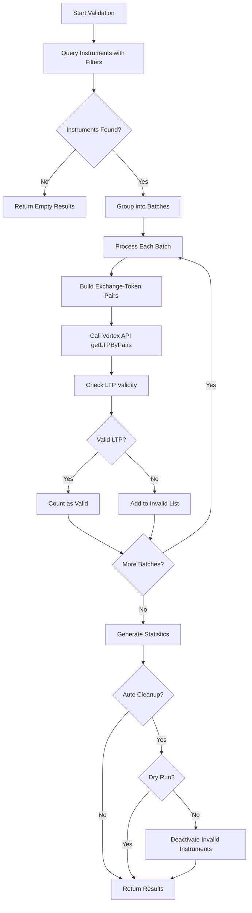

# Vortex Instruments Validation & Cleanup

## Overview

The instrument validation system allows you to test LTP fetch capability for instruments stored in the `vortex_instruments` table, identify invalid instruments that no longer return valid LTP data, and optionally clean them up.

## Endpoint

**POST** `/api/stock/vayu/validate-instruments`

## Purpose

- **Identify Invalid Instruments**: Many instruments may have invalid tokens or incorrect exchange mappings that prevent LTP data from being fetched
- **Batch Testing**: Tests instruments in configurable batches (default 1000) to respect Vortex API rate limits
- **Cleanup**: Optionally deactivates invalid instruments to keep the database clean
- **Statistics**: Provides detailed statistics on valid vs invalid instruments

## Request Body

```json
{
  "exchange": "MCX_FO",           // Optional: Filter by exchange (NSE_EQ, NSE_FO, NSE_CUR, MCX_FO)
  "instrument_name": "FUTCOM",    // Optional: Filter by instrument type
  "symbol": "GOLD",               // Optional: Filter by symbol (partial match)
  "option_type": "CE",            // Optional: Filter by option type (CE/PE/null)
  "batch_size": 1000,             // Optional: Batch size for testing (default: 1000)
  "auto_cleanup": false,          // Optional: If true, deactivates invalid instruments (default: false)
  "dry_run": true                 // Optional: If true, only reports without making changes (default: true)
}
```

### Parameters

| Parameter | Type | Required | Default | Description |
|-----------|------|----------|---------|-------------|
| `exchange` | string | No | - | Filter by exchange: `NSE_EQ`, `NSE_FO`, `NSE_CUR`, `MCX_FO` |
| `instrument_name` | string | No | - | Filter by instrument type (e.g., `FUTCOM`, `EQ`, `OPTIDX`) |
| `symbol` | string | No | - | Filter by symbol (partial match, case-insensitive) |
| `option_type` | string | No | - | Filter by option type: `CE`, `PE`, or `null` for non-options |
| `batch_size` | number | No | 1000 | Number of instruments to test per batch |
| `auto_cleanup` | boolean | No | false | If `true`, deactivates invalid instruments |
| `dry_run` | boolean | No | true | If `true`, only reports without making changes |

## Response

```json
{
  "success": true,
  "summary": {
    "total_instruments": 5000,
    "tested": 5000,
    "valid_ltp": 4500,
    "invalid_ltp": 500,
    "errors": 0
  },
  "invalid_instruments": [
    {
      "token": 12345,
      "exchange": "MCX_FO",
      "symbol": "INVALID",
      "instrument_name": "FUTCOM",
      "reason": "no_ltp_data",
      "ltp_response": null
    },
    {
      "token": 67890,
      "exchange": "NSE_EQ",
      "symbol": "BADTOKEN",
      "instrument_name": "EQ",
      "reason": "invalid_exchange",
      "ltp_response": null
    }
  ],
  "cleanup": {
    "deactivated": 0,
    "removed": 0
  },
  "batches_processed": 5,
  "timestamp": "2025-01-01T10:00:00.000Z"
}
```

### Response Fields

#### Summary

| Field | Type | Description |
|-------|------|-------------|
| `total_instruments` | number | Total number of instruments matching filters |
| `tested` | number | Number of instruments tested (should equal total_instruments) |
| `valid_ltp` | number | Number of instruments with valid LTP data |
| `invalid_ltp` | number | Number of instruments with invalid/missing LTP data |
| `errors` | number | Number of errors encountered during batch processing |

#### Invalid Instruments

Each invalid instrument includes:

| Field | Type | Description |
|-------|------|-------------|
| `token` | number | Instrument token |
| `exchange` | string | Exchange identifier |
| `symbol` | string | Trading symbol |
| `instrument_name` | string | Instrument type |
| `reason` | string | Reason for invalidity (see below) |
| `ltp_response` | any | LTP response from Vortex API (null if no response) |

#### Invalidity Reasons

| Reason | Description |
|--------|-------------|
| `invalid_exchange` | Exchange is not one of the allowed values (NSE_EQ, NSE_FO, NSE_CUR, MCX_FO) |
| `no_ltp_data` | LTP response is null (instrument doesn't exist or is inactive) |
| `invalid_ltp_value` | LTP value is not a valid positive number |
| `missing_from_response` | Instrument was not included in Vortex API response |
| `batch_error` | Error occurred while processing the batch |

#### Cleanup

| Field | Type | Description |
|-------|------|-------------|
| `deactivated` | number | Number of instruments deactivated (only if `auto_cleanup=true` and `dry_run=false`) |
| `removed` | number | Number of instruments removed (currently always 0) |

## Usage Examples

### Example 1: Validate MCX_FO Instruments (Dry Run)

```bash
curl -X POST "https://marketdata.vedpragya.com/api/stock/vayu/validate-instruments" \
  -H "Content-Type: application/json" \
  -H "x-api-key: YOUR_API_KEY" \
  -d '{
    "exchange": "MCX_FO",
    "dry_run": true,
    "batch_size": 1000
  }'
```

This will:
- Test all MCX_FO instruments
- Report which ones have invalid LTP
- **Not** make any changes to the database (dry_run=true)

### Example 2: Validate and Cleanup Invalid Instruments

```bash
curl -X POST "https://marketdata.vedpragya.com/api/stock/vayu/validate-instruments" \
  -H "Content-Type: application/json" \
  -H "x-api-key: YOUR_API_KEY" \
  -d '{
    "exchange": "MCX_FO",
    "auto_cleanup": true,
    "dry_run": false,
    "batch_size": 1000
  }'
```

This will:
- Test all MCX_FO instruments
- Deactivate instruments with invalid LTP
- **Make changes** to the database (dry_run=false)

### Example 3: Validate Specific Symbol

```bash
curl -X POST "https://marketdata.vedpragya.com/api/stock/vayu/validate-instruments" \
  -H "Content-Type: application/json" \
  -H "x-api-key: YOUR_API_KEY" \
  -d '{
    "exchange": "NSE_EQ",
    "symbol": "RELIANCE",
    "dry_run": true
  }'
```

This will:
- Test only NSE_EQ instruments with symbol containing "RELIANCE"
- Report results without making changes

## Validation Flow



## Rate Limiting

- The validation endpoint respects Vortex API rate limits (1 request per second)
- A 1-second delay is automatically added between batches
- Batch size is configurable (default: 1000 instruments per batch)

## Best Practices

1. **Always start with dry_run=true**: Test the validation without making changes
2. **Use filters**: Filter by exchange or symbol to test specific subsets
3. **Monitor batch processing**: Check console logs for progress
4. **Review invalid instruments**: Examine the `invalid_instruments` list to understand why instruments failed
5. **Cleanup carefully**: Only set `auto_cleanup=true` and `dry_run=false` after reviewing results

## Console Logging

The validation process logs detailed information to the console for easy debugging:

```
[Validate Instruments] Request received: { exchange: 'MCX_FO', batch_size: 1000, ... }
[VortexInstrumentService] Found 5000 instruments to validate
[VortexInstrumentService] Processing 5 batches of up to 1000 instruments each
[VortexInstrumentService] Processing batch 1/5 with 1000 instruments
[VortexInstrumentService] Fetching LTP for 1000 pairs in batch 1
[VortexInstrumentService] Instrument 12345 (GOLD) has valid LTP: 5234.5
[VortexInstrumentService] Instrument 67890 (BADTOKEN) has invalid LTP: reason=no_ltp_data
[VortexInstrumentService] Validation summary: { total_instruments: 5000, valid_ltp: 4500, invalid_ltp: 500, ... }
```

## Error Handling

- **Batch Errors**: If a batch fails, all instruments in that batch are marked as invalid with reason `batch_error`
- **Network Errors**: Network errors are caught and logged, with affected instruments marked as invalid
- **Database Errors**: Database errors during cleanup are caught and logged, but don't affect the validation results

## Related Endpoints

- `POST /api/stock/vayu/ltp` - Fetch LTP for specific instruments
- `GET /api/stock/vayu/instruments` - List instruments with filters
- `POST /api/stock/instruments/sync?provider=vortex` - Sync instruments from Vortex CSV

