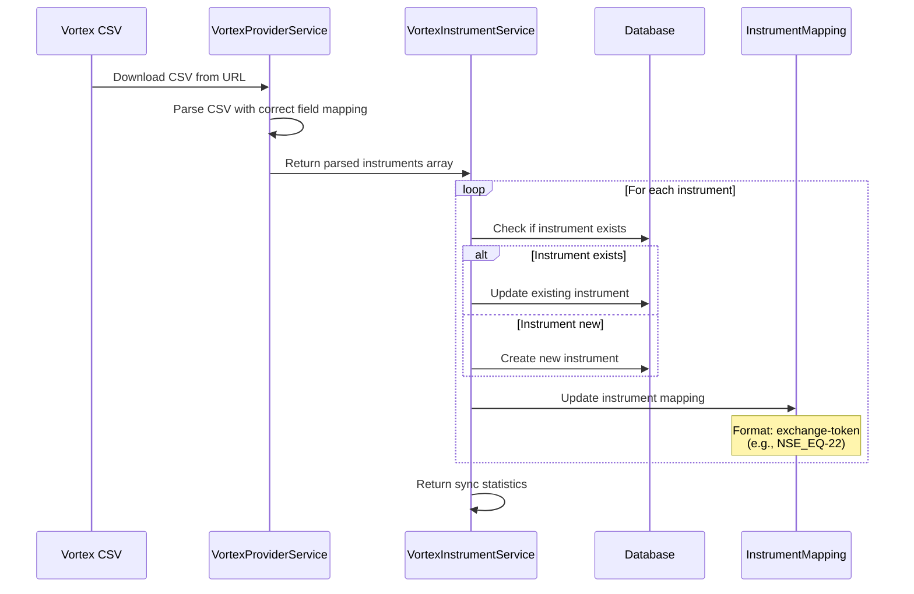

# Vortex Instruments Documentation

## Overview

This document describes the Vortex instrument synchronization system, which downloads and processes instrument data from the Vortex API CSV file and stores it in a separate `vortex_instruments` table.

## Entity Structure

### VortexInstrument Entity

The `VortexInstrument` entity represents instruments from the Vortex API CSV data:

```typescript
@Entity('vortex_instruments')
export class VortexInstrument {
  @PrimaryColumn({ type: 'int' })
  token: number;                    // Primary key - Vortex token

  @Column({ type: 'varchar', length: 16 })
  exchange: string;                  // NSE_EQ, NSE_FO, NSE_CUR, MCX_FO

  @Column({ type: 'varchar', length: 64 })
  symbol: string;                    // Trading symbol

  @Column({ type: 'varchar', length: 64 })
  instrument_name: string;           // Instrument type (FUTIDX, OPTIDX, EQ, etc.)

  @Column({ type: 'varchar', length: 8, nullable: true })
  expiry_date: string;               // YYYYMMDD format

  @Column({ type: 'varchar', length: 2, nullable: true })
  option_type: string;               // CE/PE/null

  @Column({ type: 'decimal', precision: 10, scale: 2, nullable: true })
  strike_price: number;               // Strike price in rupees

  @Column({ type: 'decimal', precision: 10, scale: 4, default: 0.05 })
  tick: number;                      // Tick size

  @Column({ type: 'int', default: 1 })
  lot_size: number;                  // Lot size

  @Column({ default: true })
  is_active: boolean;                // Active status

  @CreateDateColumn()
  created_at: Date;                  // Creation timestamp

  @UpdateDateColumn()
  updated_at: Date;                  // Last update timestamp
}
```

## CSV Field Mapping

The following table shows how Vortex CSV fields map to database columns:

| CSV Field | Database Column | Type | Description |
|-----------|----------------|------|-------------|
| `token` | `token` | int | Primary key - Vortex instrument token |
| `exchange` | `exchange` | varchar(16) | Exchange identifier (NSE_EQ, NSE_FO, NSE_CUR, MCX_FO) |
| `symbol` | `symbol` | varchar(64) | Trading symbol |
| `instrument_name` | `instrument_name` | varchar(64) | Instrument type (FUTIDX, OPTIDX, EQ, etc.) |
| `expiry_date` | `expiry_date` | varchar(8) | Expiry date in YYYYMMDD format |
| `option_type` | `option_type` | varchar(2) | Option type (CE/PE) or null |
| `strike_price` | `strike_price` | decimal(10,2) | Strike price in rupees |
| `tick` | `tick` | decimal(10,4) | Tick size (default: 0.05) |
| `lot_size` | `lot_size` | int | Lot size (default: 1) |

## Sync Process Flow



### Validation Output Enrichment
- When `include_invalid_list=true` is passed to `POST /api/stock/vayu/validate-instruments`, each invalid item includes:
  - `token`, `exchange`, `symbol`, `instrument_name`, `description`, `expiry_date`, `option_type`, `strike_price`, `tick`, `lot_size`, `reason`, `ltp_response`
- The response also contains small diagnostics:
  - `diagnostics.reason_counts` (counts per reason)
  - `diagnostics.resolution` with `{ requested, included, invalid_exchange, missing_from_response }`

## API Endpoints

### Vortex-Specific Endpoints

#### 1. Get Vortex Instruments
```
GET /api/stock/vortex/instruments
```

**Query Parameters:**
- `exchange` (optional): Filter by exchange (NSE_EQ, NSE_FO, etc.)
- `instrument_name` (optional): Filter by instrument type
- `symbol` (optional): Filter by symbol (partial match)
- `option_type` (optional): Filter by option type (CE/PE)
- `is_active` (optional): Filter by active status
- `limit` (optional): Number of results (default: 50)
- `offset` (optional): Pagination offset

**Example:**
```bash
curl -X GET "http://localhost:3000/api/stock/vortex/instruments?exchange=NSE_EQ&limit=10" \
  -H "x-api-key: your-api-key"
```

#### 2. Search Vortex Instruments
```
GET /api/stock/vortex/instruments/search
```

**Query Parameters:**
- `q` (required): Search query
- `limit` (optional): Number of results (default: 50)

**Example:**
```bash
curl -X GET "http://localhost:3000/api/stock/vortex/instruments/search?q=RELIANCE" \
  -H "x-api-key: your-api-key"
```

#### 3. Get Specific Vortex Instrument
```
GET /api/stock/vortex/instruments/:token
```

**Example:**
```bash
curl -X GET "http://localhost:3000/api/stock/vortex/instruments/22" \
  -H "x-api-key: your-api-key"
```

#### 4. Get Vortex Instrument Statistics
```
GET /api/stock/vortex/instruments/stats
```

**Example:**
```bash
curl -X GET "http://localhost:3000/api/stock/vortex/instruments/stats" \
  -H "x-api-key: your-api-key"
```

#### 5. Manual Vortex Instrument Sync
```
POST /api/stock/vortex/instruments/sync
```

**Query Parameters:**
- `exchange` (optional): Filter by exchange
- `csv_url` (optional): Override CSV URL

**Example:**
```bash
curl -X POST "http://localhost:3000/api/stock/vortex/instruments/sync" \
  -H "x-api-key: your-api-key"
```

### General Sync Endpoint (Supports Both Providers)

#### Sync Instruments
```
POST /api/stock/instruments/sync?provider=vortex
```

**Query Parameters:**
- `provider`: Set to 'vortex' for Vortex sync
- `exchange` (optional): Filter by exchange
- `csv_url` (optional): Override CSV URL

**Example:**
```bash
curl -X POST "http://localhost:3000/api/stock/instruments/sync?provider=vortex" \
  -H "x-api-key: your-api-key"
```

## Automated Sync

### Daily Cron Job

The system automatically syncs Vortex instruments daily at 8:30 AM using a cron job:

```typescript
@Cron('30 8 * * *') // 8:30 AM daily
async syncVortexInstrumentsDaily()
```

This timing aligns with the Vortex API documentation, which states that the CSV is refreshed daily after 8:30 AM.

## Configuration

### Environment Variables

Required environment variables for Vortex instrument sync:

```bash
# Vortex API Configuration
VORTEX_API_KEY=your_api_key
VORTEX_BASE_URL=https://vortex-api.rupeezy.in/v2
VORTEX_INSTRUMENTS_CSV_URL=https://static.rupeezy.in/master.csv
```

### Database Migration

Run the migration to create the `vortex_instruments` table:

```bash
npm run migration:run
```

## Instrument Mapping

The system creates instrument mappings in the `instrument_mappings` table with the format:
- **Provider**: `vortex`
- **Provider Token**: `{exchange}-{token}` (e.g., `NSE_EQ-22`)
- **Instrument Token**: The numeric token from Vortex

This mapping allows the system to:
1. Convert Vortex tokens to exchange-token format for API calls
2. Maintain compatibility with existing market data streaming
3. Support both Kite and Vortex providers simultaneously

## Troubleshooting

### Common Issues

#### 1. CSV Download Fails
**Symptoms:** Empty instrument list, warnings in logs
**Solutions:**
- Check `VORTEX_INSTRUMENTS_CSV_URL` configuration
- Verify network connectivity to `https://static.rupeezy.in/master.csv`
- Check if CSV URL is accessible

#### 2. CSV Parsing Errors
**Symptoms:** Fewer instruments than expected, parsing warnings
**Solutions:**
- Check CSV format matches Vortex API documentation
- Verify field names in CSV header
- Review debug logs for specific parsing issues

#### 3. Database Errors
**Symptoms:** Sync failures, constraint violations
**Solutions:**
- Ensure migration has been run
- Check database permissions
- Verify entity field types match CSV data

#### 4. Mapping Issues
**Symptoms:** Market data calls fail, wrong exchange mapping
**Solutions:**
- Check `instrument_mappings` table for correct entries
- Verify exchange normalization logic
- Review token format in mappings

### Debug Logging

Enable debug logging to troubleshoot issues:

```typescript
// In VortexProviderService
this.logger.debug(`[Vortex] Parsed instrument ${items.length + 1}:`, instrument);

// In VortexInstrumentService
this.logger.debug(`[VortexInstrumentService] Created instrument token=${token}, symbol=${symbol}`);
```

### Health Checks

Check system health:

```bash
# Check Vortex provider status
curl -X GET "http://localhost:3000/api/admin/debug/vortex" \
  -H "x-admin-token: your-admin-token"

# Check instrument stats
curl -X GET "http://localhost:3000/api/stock/vortex/instruments/stats" \
  -H "x-api-key: your-api-key"
```

## Best Practices

1. **Regular Monitoring**: Check daily sync logs to ensure successful completion
2. **Error Handling**: Monitor for CSV download failures or parsing errors
3. **Data Validation**: Verify instrument counts and mapping accuracy
4. **Performance**: Use pagination for large instrument queries
5. **Backup**: Consider backing up instrument data before major syncs

## Integration with Market Data

Vortex instruments integrate with the market data streaming system:

1. **Token Resolution**: System uses `instrument_mappings` to resolve Vortex tokens
2. **Exchange Mapping**: Converts tokens to `exchange-token` format for API calls
3. **Streaming**: Supports WebSocket streaming for Vortex instruments
4. **Quote Requests**: Handles REST API quote requests for Vortex instruments

The system maintains compatibility with existing Kite instruments while adding full Vortex support.
