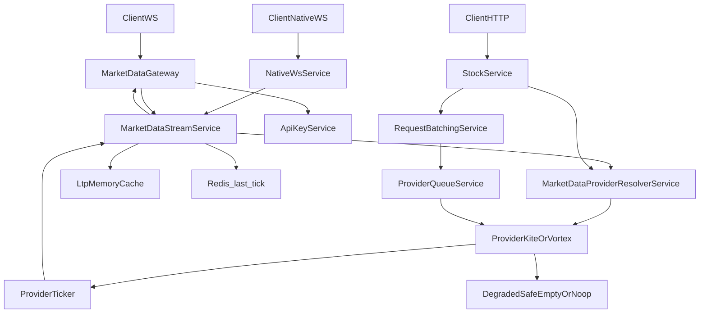

# Market Data Architecture

Single entry point for how real-time and batched HTTP market data flow through this feature.

## Documents

| Doc | Scope |
|-----|--------|
| [application/STREAMING_FLOWCHART.md](application/STREAMING_FLOWCHART.md) | WS tick path, degraded mode, queues, metrics |
| [interface/GATEWAYS.md](interface/GATEWAYS.md) | Socket.IO + native WS, entitlements, batching |
| [application/SYNC_FLOW.md](application/SYNC_FLOW.md) | Instrument sync (if present) |
| [MODULE_DOC.md](MODULE_DOC.md) | Module purpose and changelog |

## End-to-end (HTTP + WS)

## Provider contract

- [`infra/market-data.provider.ts`](../infra/market-data.provider.ts) — `MarketDataProvider` with optional `getLTPByPairs` and `primeExchangeMapping`.
- **Kite**: HTTP methods return `{}` / `[]` / `null` when the REST client is not initialized; `getLTPByPairs` maps pair keys to LTP.
- **Vortex**: Already returned empty maps when HTTP is unavailable; optional methods implemented on the concrete ticker/service.

## Observability

- Prometheus: `MetricsService` registers stream and `provider_degraded_mode{provider}` gauges.
- Health: `GET /health` and `GET /health/market-data` include `streaming` status, `marketData` snapshot (`wsTickerReady`, `marketDataDegraded`, `queues`), and provider `debug` blobs.
