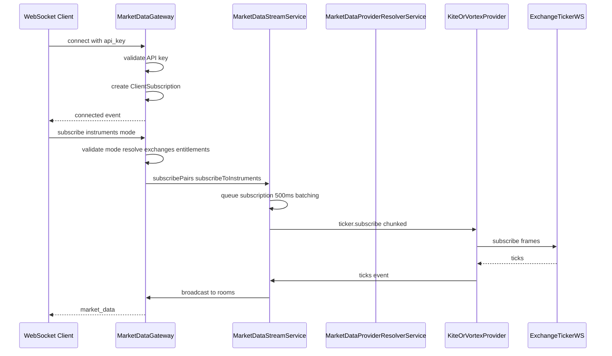

# WebSocket Gateway Architecture

## Overview

Market data is exposed over:

- **Socket.IO** — `MarketDataGateway` on namespace `/market-data` (primary SaaS path).
- **Native WebSocket** — `NativeWsService` on path `/ws` (manual upgrade, same stream backend).

Both validate API keys, respect rate limits, and delegate to `MarketDataStreamService`.

## Architecture Flow

## Entitlements (exchange allow-list)

- On **subscribe**, resolved exchanges are compared to the API key allowed exchange set. Pairs outside the set appear in `forbidden` on `subscription_confirmed` and emit `error` with `code: forbidden_exchange`.
- On **API key entitlement hot-reload** (`api_key_updates` Redis channel), the gateway re-resolves tokens. **Fail-open for unresolved exchange**: if the resolver cannot map a token to an exchange, the token is **not** revoked (only tokens with a **resolved** exchange **not** in the allow-list are revoked). See `handleApiKeyUpdate` in `market-data.gateway.ts`.

## Modes and outbound tick shape

- Subscribe with `mode`: `ltp` | `ohlcv` | `full`. Upstream (Vortex) receives the same mode on JSON subscribe frames; if a token is already subscribed at a lower mode, the Vortex layer **upgrades** mode by re-sending subscribe with the higher mode.
- **`market_data`** to each client is filtered to match that client’s `modeByInstrument` for the token (LTP-only clients do not receive full depth in the payload).

## Native WebSocket (`/ws`)

- Message: `{ "event": "set_mode", "data": { "instruments": [26000], "mode": "full" } }` — same semantics as Socket.IO `set_mode` (only tokens already subscribed are updated).
- `subscription_confirmed` includes `limits` when available (`maxUpstreamInstruments`, Vortex `maxVortexShards`, etc.).

## Socket.IO limits ack

- `subscription_confirmed.limits` includes `maxUpstreamInstruments` (total across Vortex shards when using Vortex), plus `maxSubscriptionsPerSocket`, `maxVortexShards`, `maxVortexInstruments` when `getVortexWsLimits()` is available.

## Batching

- Subscriptions are queued and flushed every **500ms**.
- Chunk size **500** instruments per provider subscribe call.
- Queue depth surfaces in `subscription_confirmed.queues` and Prometheus `provider_queue_depth`.

## Stream status (Redis)

- `MarketDataStreamService` publishes `stream:status` for `connected`, `disconnected`, `error`, and `degraded` (no ticker). Gateway can forward as `stream_status` to clients where implemented.

## Error handling

- Rate limits: `rate_limited` errors with `retry_after_ms`.
- Streaming inactive: `stream_inactive` if admin has not started the provider stream (`isStreaming` false).
- Provider errors: Nest `Logger`; degraded HTTP paths return empty objects from providers where configured (Kite when REST client missing).
