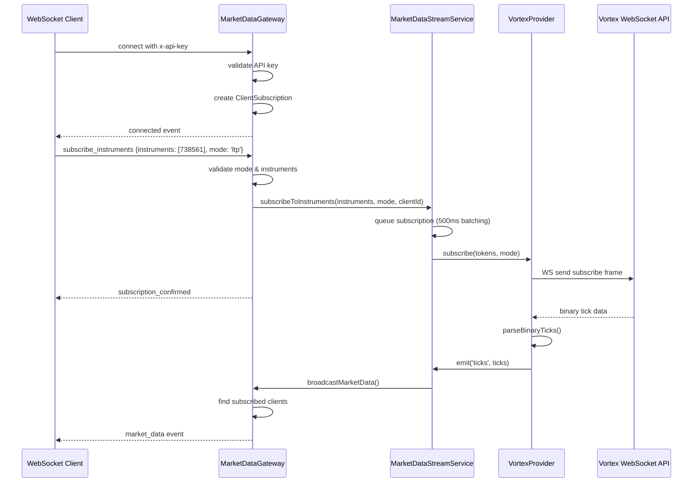

# WebSocket Gateway Architecture

## Overview

The Market Data Gateway handles real-time WebSocket connections for market data streaming, implementing intelligent request batching and mode-aware subscriptions.

## Architecture Flow



## Key Features

### 1. Mode-Aware Subscriptions
- Supports three modes: `ltp`, `ohlcv`, `full`
- Each client can specify mode per subscription
- Mode determines binary packet size (22/62/266 bytes)

### 2. Intelligent Batching
- Collects subscription requests for 500ms before sending to provider
- Deduplicates instruments across multiple clients
- Groups by mode for efficient provider calls
- Tracks client reference counts for proper cleanup

### 3. Connection Management
- API key validation and rate limiting
- Connection limit enforcement per API key
- Automatic cleanup on disconnect
- Graceful error handling

### 4. Broadcasting Optimization
- Uses Socket.IO rooms for targeted broadcasting
- Only broadcasts to clients subscribed to specific instruments
- Tracks broadcast latency and metrics

## Batching Flow

```mermaid
graph TD
    A[Client 1: subscribe [738561,5633] mode=ltp] --> C[Subscription Queue]
    B[Client 2: subscribe [738561] mode=full] --> C
    D[Client 3: subscribe [5633] mode=ohlcv] --> C
    
    C --> E[500ms Batch Timer]
    E --> F[Deduplicate & Group by Mode]
    F --> G[Mode Groups: ltp=[738561,5633], full=[738561], ohlcv=[5633]]
    G --> H[Send to Provider]
    H --> I[Update Client Subscriptions]
    I --> J[Broadcast to Rooms]
```

## Error Handling

- Graceful degradation on provider failures
- Auto-reconnection with exponential backoff
- Rate limit detection and handling
- Invalid mode fallback to 'ltp'
- Comprehensive error logging

## Performance Metrics

- Batch efficiency: 100+ user requests → <10 provider calls
- Broadcast latency: <5ms for 100 clients
- Memory usage: <500MB for 1000 connections
- Reconnect time: <2s on disconnect
