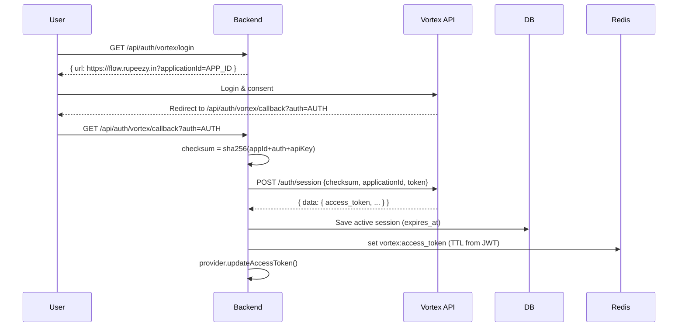

## Market Data Providers

### Vortex Provider

- Login: GET `/api/auth/vortex/login` → redirect to Rupeezy flow.
- Callback: `/api/auth/vortex/callback?auth=...` computes `sha256(appId+auth+apiKey)`, calls Create Session, stores DB `vortex_sessions`, caches token in Redis with JWT TTL, refreshes provider in-memory.
- HTTP APIs: `getQuote`, `getLTP`, `getOHLC`, `getHistoricalData` call `VORTEX_BASE_URL` with `x-api-key` and `Authorization: Bearer <access_token>`.
- Instruments: downloads CSV from `VORTEX_INSTRUMENTS_CSV_URL` with retries, parses, and normalizes for DB sync.
- Streaming: `VORTEX_WS_URL?auth_token=<token>` with heartbeat, backoff, and per-quote binary parsing (lengths 22/62/266). Supports subscribe/unsubscribe and per-token mode.

#### Flowchart

### Kite Provider

- Unchanged; OAuth flow via `/api/auth/kite/*`, cached access token in Redis.

