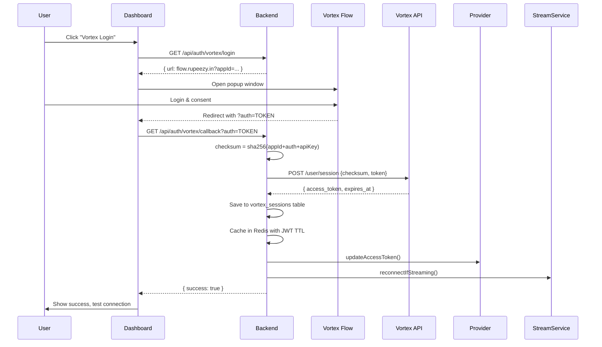

# Vortex Provider Implementation Guide

## Overview

Complete implementation of Rupeezy Vortex API integration with WebSocket streaming, HTTP APIs, and authentication flow.

## Authentication Flow



## WebSocket Implementation

### Connection Setup
```typescript
// WebSocket URL with auth token
const url = `wss://wire.rupeezy.in/ws?auth_token=${encodeURIComponent(accessToken)}`;
const ws = new WebSocket(url);
```

### Subscription Management
```typescript
// Subscribe to instruments with mode
ws.send(JSON.stringify({
  exchange: "NSE_EQ",
  token: 738561,
  mode: "ltp", // or "ohlcv", "full"
  message_type: "subscribe"
}));
```

### Binary Data Parsing
The WebSocket sends binary data in three packet sizes:

- **LTP Mode (22 bytes)**: Last trade price only
- **OHLCV Mode (62 bytes)**: OHLC + Volume data
- **Full Mode (266 bytes)**: Complete data with depth

```typescript
// Binary packet structure (Little Endian)
// [Exchange: 10 bytes] [Token: 4 bytes] [Price: 8 bytes] [Additional data...]
```

## HTTP API Integration

### Quotes Endpoint
```typescript
// GET /data/quotes?q=exchange-token&mode=mode
const response = await http.get(`/data/quotes?q=NSE_EQ-738561&mode=full`, {
  headers: {
    'x-api-key': apiKey,
    'Authorization': `Bearer ${accessToken}`
  }
});
```

### Historical Data
```typescript
// GET /data/history?exchange=EXCHANGE&token=TOKEN&from=FROM&to=TO&resolution=RESOLUTION
const response = await http.get(`/data/history?exchange=NSE_EQ&token=738561&from=1640995200&to=1641081600&resolution=1D`);
```

## Rate Limiting

- **HTTP APIs**: 1 request per second per endpoint
- **WebSocket**: Maximum 1000 subscriptions per connection
- **Daily Limit**: 50,000 API requests per day

## Error Handling

### Connection Errors
```typescript
ws.on('error', (error) => {
  logger.error('[Vortex] WebSocket error:', error);
  // Implement reconnection logic
});
```

### Rate Limit Handling
```typescript
if (response.status === 429) {
  logger.warn('[Vortex] Rate limit exceeded, backing off');
  await new Promise(resolve => setTimeout(resolve, 1000));
}
```

### Authentication Errors
```typescript
if (response.status === 401) {
  logger.error('[Vortex] Authentication failed, token may be expired');
  // Trigger re-authentication flow
}
```

## Configuration

### Environment Variables
```bash
VORTEX_APP_ID=your_application_id
VORTEX_API_KEY=your_api_key
VORTEX_BASE_URL=https://vortex-api.rupeezy.in/v2
VORTEX_WS_URL=wss://wire.rupeezy.in/ws
VORTEX_INSTRUMENTS_CSV_URL=https://static.rupeezy.in/master.csv
```

### Database Schema
```sql
CREATE TABLE vortex_sessions (
  id SERIAL PRIMARY KEY,
  access_token TEXT NOT NULL,
  expires_at TIMESTAMP,
  is_active BOOLEAN DEFAULT TRUE,
  metadata JSONB,
  created_at TIMESTAMP DEFAULT NOW(),
  updated_at TIMESTAMP DEFAULT NOW()
);
```

## Monitoring & Debugging

### Health Checks
```typescript
// Check HTTP API health
const health = await vortexProvider.ping();
// Returns: { httpOk: boolean, reason?: string }
```

### Debug Logging
```typescript
// Enable debug logging for detailed WebSocket communication
logger.debug('[Vortex] Parsed binary tick:', tickData);
logger.debug('[Vortex] WebSocket subscription sent:', subscriptionData);
```

### Metrics Tracking
- Connection status and uptime
- Subscription count and mode distribution
- Binary packet parsing success rate
- Rate limit violations and backoff events
- Authentication token expiry warnings

## Best Practices

1. **Token Management**: Always check token expiry before API calls
2. **Error Recovery**: Implement exponential backoff for reconnections
3. **Subscription Limits**: Monitor subscription count to stay under 1000 limit
4. **Mode Selection**: Use appropriate mode based on data requirements
5. **Rate Limiting**: Respect 1 req/sec limit for HTTP APIs
6. **Binary Parsing**: Handle all three packet sizes gracefully
7. **Health Monitoring**: Regular health checks for connection status

## Troubleshooting

### Common Issues

1. **Authentication Failures**
   - Check VORTEX_APP_ID and VORTEX_API_KEY configuration
   - Verify access token is not expired
   - Ensure checksum calculation is correct

2. **WebSocket Connection Issues**
   - Verify VORTEX_WS_URL is correct
   - Check access token validity
   - Monitor rate limits and connection limits

3. **Binary Parsing Errors**
   - Verify packet length matches expected mode
   - Check endianness (little endian)
   - Handle unknown packet sizes gracefully

4. **Rate Limit Exceeded**
   - Implement proper backoff strategies
   - Monitor request frequency
   - Consider request batching for efficiency
