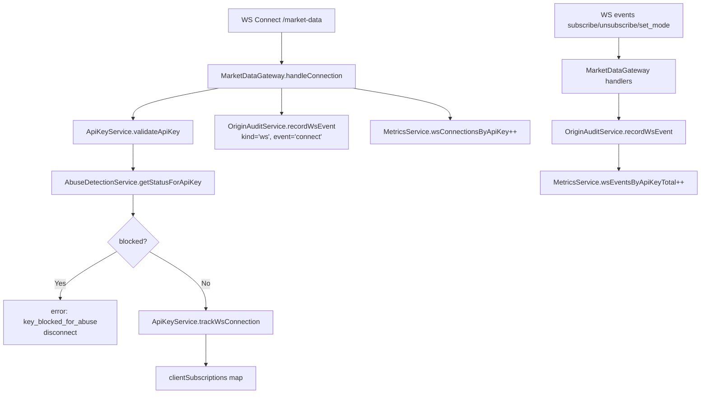
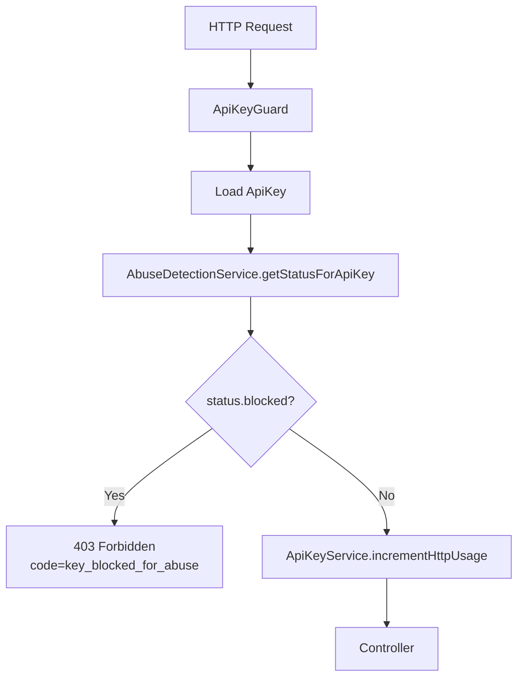
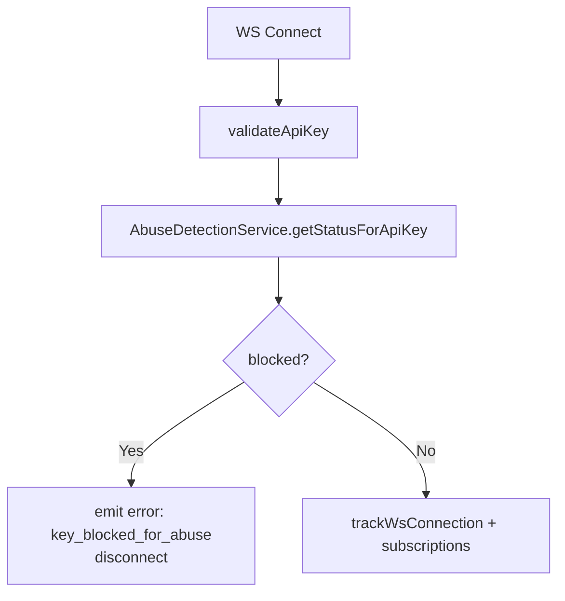

# Origin Monitoring & Anti-Resell Flow

## Overview

This document describes how the backend:

- Captures **where** requests are coming from (IP, API key, route/event).
- Stores **audit logs** for HTTP and WebSocket traffic.
- Exposes **metrics** for dashboards.
- Detects **resell-like abuse patterns** and **blocks** offending API keys.

---

## 1. HTTP Origin Capture & Auditing

### High-Level Flow

```mermaid
flowchart TD
  A[Client HTTP Request] --> B[Global Interceptors]
  B --> C[OriginAuditInterceptor]
  B --> D[MetricsInterceptor]
  C --> E[OriginAuditService buffer]
  E --> F[request_audit_logs table]
  D --> G[Prometheus metrics]
  B --> H[ApiKeyGuard<br/>(per-key limits + abuse check)]
  H --> I[Controller Handler]
```

### Details

- `OriginAuditInterceptor`:
  - Extracts origin metadata:
    - `apiKey` from `x-api-key` header or `api_key` query.
    - `ip` from `x-forwarded-for` or `req.ip`.
    - `userAgent` from `User-Agent`.
    - `origin` / `referer` headers.
    - `route`, `method`, `status`, `duration_ms`.
  - Sends a small object to `OriginAuditService.recordHttp()`.

- `OriginAuditService`:
  - Buffers `RequestAuditLog` objects in memory.
  - Flushes in **batches** to Postgres:
    - Table: `request_audit_logs`.
    - Columns: `api_key`, `tenant_id`, `kind='http'`, `route_or_event`, `ip`, `user_agent`, `origin`, `duration_ms`, `meta`, etc.
  - Uses robust try/catch + console logs and **never blocks** requests.

- `AuditCleanupCronService`:
  - Runs daily (`EVERY_DAY_AT_4AM`).
  - Deletes rows older than `AUDIT_LOG_RETENTION_DAYS` (default 90).

---

## 2. WebSocket Origin Capture & Auditing

### High-Level Flow



### Details

- On **connect**:
  - Validates API key via `ApiKeyService.validateApiKey`.
  - Checks abuse status (`AbuseDetectionService.getStatusForApiKey`):
    - If `blocked`, emits `error { code: 'key_blocked_for_abuse', ... }` and disconnects.
  - Tracks active connections with `ApiKeyService.trackWsConnection`.
  - Captures origin metadata from Socket.IO handshake:
    - `ip`, `userAgent`, `origin` (similar headers as HTTP).
  - Records a `ws` audit entry:
    - `event='connect'`, `status=101`, `meta={ socketId, namespace }`.
  - Increments `wsConnectionsByApiKey{api_key}` Prometheus gauge.

- On **disconnect**:
  - Untracks connection via `ApiKeyService.untrackWsConnection`.
  - Decrements `wsConnectionsByApiKey{api_key}` gauge.
  - Records a `ws` audit entry:
    - `event='disconnect'`, `status=499`.

- On **subscribe / unsubscribe / set_mode**:
  - Existing payload validation and rate limiting remain in place.
  - After success:
    - Updates subscriptions in-memory.
    - Emits business events back to client.
    - Updates metrics:
      - `wsEventsByApiKeyTotal{api_key,event}` counter.
    - (The heavy per-event auditing is primarily handled for connects/disconnects; extensions can be added if you want full per-event logging.)

---

## 3. Abuse Detection & Anti-Resell Logic

### Data Sources

- `request_audit_logs`:
  - HTTP + WS events with `api_key`, `ip`, `kind`, `route_or_event`, `ts`.
- Metrics:
  - `ws_connections_by_api_key`.
  - `ws_events_by_api_key_total{api_key,event}`.

### Detection Flow

```mermaid
flowchart TD
  A[AbuseDetectionService Cron<br/>EVERY_5_MINUTES] --> B[Query request_audit_logs<br/>ts >= now - windowMinutes]
  B --> C[Group by api_key<br/>total, unique_ips]
  C --> D[computeRiskScore(total, unique_ips)]
  D --> E[Upsert ApiKeyAbuseFlag]
  E --> F[blocked = blocked OR score >= blockScoreThreshold]
```

- Config (via env, with sane bounds):
  - `ABUSE_WINDOW_MINUTES` (default 10).
  - `ABUSE_UNIQUE_IP_THRESHOLD` (default 20).
  - `ABUSE_TOTAL_REQ_THRESHOLD` (default 1000).
  - `ABUSE_BLOCK_SCORE_THRESHOLD` (default 100).

- `computeRiskScore(totalRequests, uniqueIps)`:
  - Adds points for:
    - `many_ips`: unique IPs ≥ threshold.
    - `high_volume`: total requests ≥ threshold.
    - `extremely_many_ips`: far above threshold.
  - Populates `reason_codes` on `ApiKeyAbuseFlag` accordingly.

- `ApiKeyAbuseFlag` table:
  - `api_key`, `tenant_id`, `risk_score`, `reason_codes`, `blocked`, `detected_at`, `updated_at`, `last_seen_at`.
  - Once `blocked = true`, it **stays blocked** until an admin manually unblocks.

---

## 4. Strict Enforcement (Blocking & Throttling)

### HTTP Enforcement (ApiKeyGuard)



- On blocked key:
  - Logs via `Logger` + `console.log`.
  - Returns:
    - `code: 'key_blocked_for_abuse'`
    - `risk_score`, `reasons` array.

### WebSocket Enforcement (MarketDataGateway)



- On blocked key:
  - Emits WS `error` payload with:
    - `code: 'key_blocked_for_abuse'`
    - `risk_score`, `reasons`.
  - Immediately disconnects the socket.

---

## 5. Admin Controls & Monitoring

### Abuse Flags Management

Admin endpoints (all protected by `AdminGuard` / `x-admin-token`):

- `GET /api/admin/abuse/flags?blocked=&page=&pageSize=`:
  - Lists `ApiKeyAbuseFlag` records.
  - Filter by `blocked=true|false` when needed.
- `GET /api/admin/abuse/flags/:key`:
  - Returns:
    - `flag` (DB row).
    - `status` from `AbuseDetectionService.getStatusForApiKey`.
- `POST /api/admin/abuse/flags/block`:
  - Body: `{ api_key: string, reason?: string }`.
  - Forces `blocked=true`, bumps `risk_score` to at least the block threshold, appends `manual_block` + custom reason to `reason_codes`.
- `POST /api/admin/abuse/flags/unblock`:
  - Body: `{ api_key: string }`.
  - Sets `blocked=false`, resets `risk_score` to `0`, appends `manual_unblock` to `reason_codes`.

### Usage & Origin Summary

Combined with existing endpoints:

- `GET /api/admin/apikeys/usage`:
  - Paginated list of API keys with:
    - Limits (HTTP per-minute, WS connection, WS RPS).
    - Live Redis usage snapshot.
- `GET /api/admin/ws/status`:
  - Includes `byApiKey` section from `MarketDataGateway.getConnectionStats()`:
    - `apiKey`, `connections`, `totalSubscribedInstruments`.

Together with Prometheus metrics and audit logs, this gives a **full view** of:

- Who is calling your APIs.
- From where (IP-level today, geo/ASN pluggable later).
- How heavily each key is used.
- Which keys look like they are being shared / resold.

---

## 6. Sampling & Tuning (Keeping Logs High-Signal)

To avoid flooding `request_audit_logs`, the system uses **sampling**:

- **HTTP sampling**
  - Env vars:
    - `AUDIT_HTTP_SAMPLE_RATE` (default: `0.01` → ~1% of non-error requests).
    - `AUDIT_HTTP_ALWAYS_LOG_ERRORS` (default: `true`).
  - Behaviour:
    - If `status >= 400` and `AUDIT_HTTP_ALWAYS_LOG_ERRORS=true` → **always logged**.
    - Otherwise → logged only when `Math.random() < AUDIT_HTTP_SAMPLE_RATE`.

- **WebSocket sampling**
  - Env var:
    - `AUDIT_WS_SUB_SAMPLE_RATE` (default: `0` → no subscribe/unsubscribe logging).
  - Behaviour inside `OriginAuditService.recordWsEvent`:
    - `connect` / `disconnect` → **always logged**.
    - `subscribe` / `unsubscribe` → logged only when `Math.random() < AUDIT_WS_SUB_SAMPLE_RATE`.

- **Admin visibility**
  - `GET /api/admin/audit/config` returns the effective audit config:
    - `http_sample_rate`
    - `http_always_log_errors`
    - `ws_sub_sample_rate`

Recommended starting values:

- Production: `AUDIT_HTTP_SAMPLE_RATE=0.01`, `AUDIT_WS_SUB_SAMPLE_RATE=0.01`.
- Staging/testing: higher sample rates (e.g. `0.1` or `1`) while you’re validating behaviour.


