# Redis Service Flow Chart

## Complete Application Startup Flow

```mermaid
flowchart TD
    Start([Application Start]) --> AppModule[Load AppModule]
    AppModule --> LoadModules[Load All Modules]
    LoadModules --> InitRedis[RedisService.onModuleInit]
    
    InitRedis --> CreateClients[Create Redis Clients<br/>main, subscriber, publisher]
    CreateClients --> AddErrorHandlers[Add Error Event Handlers]
    AddErrorHandlers --> AttemptConnect{Connect with<br/>5s Timeout}
    
    AttemptConnect -->|Success| SetConnected[Set isConnected = true]
    AttemptConnect -->|Timeout/Error| SetDisconnected[Set isConnected = false]
    
    SetConnected --> LogSuccess[✅ Log: Redis connected]
    SetDisconnected --> LogWarning[⚠️  Log: Redis not available<br/>App will continue without cache]
    
    LogSuccess --> AppReady[🚀 Application Ready<br/>With Caching]
    LogWarning --> CleanupClients[Cleanup partial connections]
    CleanupClients --> AppReady2[🚀 Application Ready<br/>Without Caching]
    
    AppReady --> Running[Application Running]
    AppReady2 --> Running
    
    style SetDisconnected fill:#fff3cd
    style LogWarning fill:#fff3cd
    style AppReady2 fill:#d1ecf1
    style AppReady fill:#d4edda
```



## Redis Operation Flow (Any Method)

```mermaid
flowchart TD
    MethodCall([Client calls<br/>RedisService method]) --> CheckConnection{Is Redis<br/>Connected?}
    
    CheckConnection -->|No| LogNoRedis[📝 Console log:<br/>Redis not available]
    CheckConnection -->|Yes| TryOperation[Try Redis Operation]
    
    LogNoRedis --> ReturnDefault[Return Safe Default<br/>null / [] / {} / void / 0]
    
    TryOperation --> OperationResult{Success?}
    
    OperationResult -->|Success| LogSuccess[✅ Console log:<br/>Operation successful]
    OperationResult -->|Error| LogError[❌ Console log:<br/>Operation failed]
    
    LogSuccess --> ReturnValue[Return Actual Value]
    LogError --> ReturnDefault
    
    ReturnValue --> End([Method Complete])
    ReturnDefault --> End
    
    style CheckConnection fill:#e3f2fd
    style LogNoRedis fill:#fff3cd
    style LogError fill:#f8d7da
    style LogSuccess fill:#d4edda
    style ReturnDefault fill:#e8f5e9
```

## Specific Example: get() Method

```mermaid
flowchart TD
    GetCall([redisService.get 'user:123']) --> CheckConn{isConnected?}
    
    CheckConn -->|false| LogNotAvail[Console: Redis not available]
    CheckConn -->|true| TryGet[Execute: client.get 'user:123']
    
    LogNotAvail --> ReturnNull1[Return null]
    
    TryGet --> GetResult{Result?}
    
    GetResult -->|Found| Parse[JSON.parse value]
    GetResult -->|Not Found| ReturnNull2[Return null]
    GetResult -->|Error| CatchError[Catch Error]
    
    Parse --> LogHit[Console: ✅ HIT]
    ReturnNull2 --> LogMiss[Console: ℹ️  MISS]
    CatchError --> LogErr[Console: ❌ Error]
    
    LogHit --> ReturnData[Return parsed data]
    LogMiss --> ReturnNull3[Return null]
    LogErr --> ReturnNull4[Return null]
    
    ReturnNull1 --> Done([Complete])
    ReturnData --> Done
    ReturnNull3 --> Done
    ReturnNull4 --> Done
    
    style CheckConn fill:#e3f2fd
    style LogNotAvail fill:#fff3cd
    style LogHit fill:#d4edda
    style LogMiss fill:#d1ecf1
    style LogErr fill:#f8d7da
```



## Error Handling Hierarchy

```mermaid
flowchart TD
    Operation[Redis Operation] --> Level1{Connection Check}
    
    Level1 -->|Not Connected| Return1[Return Safe Default<br/>⚠️  Warning already logged at init]
    Level1 -->|Connected| Level2[Execute Operation]
    
    Level2 --> TryCatch{Try-Catch}
    
    TryCatch -->|Success| Success[✅ Log success<br/>Return actual value]
    TryCatch -->|Error| CatchBlock[Catch Block]
    
    CatchBlock --> LogError[❌ Log error details]
    LogError --> Return2[Return Safe Default<br/>Graceful degradation]
    
    Return1 --> AppContinues[Application Continues]
    Success --> AppContinues
    Return2 --> AppContinues
    
    style Level1 fill:#e3f2fd
    style Return1 fill:#fff3cd
    style Success fill:#d4edda
    style CatchBlock fill:#f8d7da
    style Return2 fill:#fff3cd
    style AppContinues fill:#d4edda
```



## Connection Lifecycle

```mermaid
stateDiagram-v2
    [*] --> Initializing: App Starts
    
    Initializing --> Connecting: Create Clients
    
    Connecting --> Connected: Success
    Connecting --> Disconnected: Timeout/Error
    
    Connected --> Operating: Normal Operations
    Connected --> ErrorState: Runtime Error
    
    ErrorState --> Disconnected: Set isConnected=false
    
    Operating --> Shutting: App Shutdown
    Disconnected --> Shutting: App Shutdown
    
    Shutting --> [*]: Cleanup Complete
    
    note right of Disconnected
        ⚠️  Warning logged
        App continues running
        All ops return defaults
    end note
    
    note right of Connected
        ✅ Success logged
        All ops fully functional
        Caching enabled
    end note
```



## Cache Hit/Miss Flow

```mermaid
sequenceDiagram
    participant Client
    participant RedisService
    participant RedisServer
    participant Database
    
    Client->>RedisService: get('market:NIFTY')
    
    alt Redis Connected
        RedisService->>RedisServer: GET market:NIFTY
        
        alt Key Exists
            RedisServer-->>RedisService: Return value
            RedisService-->>Client: ✅ Cache HIT - Return data
        else Key Not Found
            RedisServer-->>RedisService: null
            RedisService-->>Client: ℹ️  Cache MISS - Return null
            Client->>Database: Fetch from DB
            Database-->>Client: Return data
            Client->>RedisService: set('market:NIFTY', data)
            RedisService->>RedisServer: SET market:NIFTY
        end
        
    else Redis Not Connected
        RedisService-->>Client: ⚠️  Redis unavailable - Return null
        Client->>Database: Fetch from DB
        Database-->>Client: Return data
        Note over Client,Database: No caching available
    end
```



## Pub/Sub Flow

```mermaid
sequenceDiagram
    participant Publisher
    participant RedisService
    participant RedisServer
    participant Subscriber1
    participant Subscriber2
    
    alt Redis Connected
        Subscriber1->>RedisService: subscribe('market-updates', callback1)
        RedisService->>RedisServer: SUBSCRIBE market-updates
        RedisServer-->>RedisService: ✅ Subscribed
        
        Subscriber2->>RedisService: subscribe('market-updates', callback2)
        RedisService->>RedisServer: SUBSCRIBE market-updates
        RedisServer-->>RedisService: ✅ Subscribed
        
        Publisher->>RedisService: publish('market-updates', data)
        RedisService->>RedisServer: PUBLISH market-updates
        
        RedisServer-->>Subscriber1: Message
        RedisServer-->>Subscriber2: Message
        
        Note over Subscriber1,Subscriber2: Both receive real-time updates
        
    else Redis Not Connected
        Subscriber1->>RedisService: subscribe('market-updates', callback1)
        RedisService-->>Subscriber1: ⚠️  Silent return (no-op)
        
        Publisher->>RedisService: publish('market-updates', data)
        RedisService-->>Publisher: ⚠️  Silent return (no-op)
        
        Note over Publisher,Subscriber1: No pub/sub available<br/>Use alternative mechanism
    end
```



## Summary

### Key Design Principles

1. **Non-Blocking Initialization**: Connection failure doesn't prevent app startup
2. **Graceful Degradation**: All operations return safe defaults when Redis unavailable
3. **Comprehensive Logging**: Every operation logs its status for debugging
4. **Error Resilience**: Multiple layers of error handling
5. **State Tracking**: `isConnected` flag prevents operations on disconnected clients

### Benefits

- 🧪 **Local Development**: Test without infrastructure
- 🚀 **Deployment Flexibility**: Deploy without Redis initially
- 🛡️  **Fault Tolerance**: Continue operating if Redis crashes
- 🔍 **Debugging**: Extensive console logs for troubleshooting
